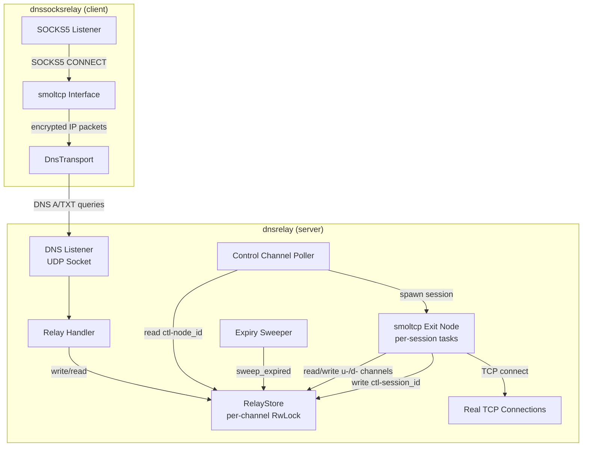

# Design Document: Broker Relay Mode

## Overview

This design introduces two new binaries — `dnsrelay` and `dnssocksrelay` — that provide a simplified, single-process deployment model for the smoltcp DNS tunnel. The core insight is that smoltcp already handles TCP reliability, retransmission, ordering, and flow control, so the broker's FIFO queues, replay buffers, cursor tracking, and adaptive response sizing are unnecessary overhead. Instead, a `RelayStore` provides single-slot-per-sender semantics: each write overwrites the previous value, and reads broadcast the latest packet to every poller.

The `dnsrelay` binary combines a DNS listener, the RelayStore, and the smoltcp exit node into a single process. The `dnssocksrelay` binary is the client-side SOCKS5 proxy that tunnels traffic through `dnsrelay`. Both binaries reuse existing modules extensively — crypto, smol_device, smol_frame, smol_poll, dns, encoding, socks, transport, and guard — and introduce minimal new code.

### Key Differences from Traditional Architecture

| Aspect | Traditional Broker | Relay Mode |
|--------|-------------------|------------|
| Store | ChannelStore: per-channel FIFO queues | RelayStore: single-slot-per-(channel, sender_id) |
| Replay | Per-channel replay buffer with cursor advancement | None — smoltcp handles retransmission |
| Adaptive sizing | AIMD algorithm per channel | None — always return all slots |
| Processes | Broker + Exit Node (or embedded) + Client | dnsrelay (single process) + dnssocksrelay |
| Control channel | Shared `ctl-<node_id>`, demuxed by ControlDispatcher | Per-session `ctl-<session_id>` for responses |
| Exit node data I/O | Via DNS transport or DirectTransport | Direct in-process RelayStore access |
| Locking | Single `Arc<RwLock>` around entire store | Per-channel `RwLock` + `AtomicU64` sequence counter |

## Architecture



### dnsrelay Main Loop


## Components and Interfaces

### 1. RelayStore (`src/relay_store.rs` in the broker crate)

The RelayStore lives in the broker crate (`dns-message-broker`) alongside the existing `store.rs`. It is a separate data structure from `ChannelStore` — they share no code or state.

```rust
/// A single-slot buffer keyed by (channel, sender_id).
pub struct PacketSlot {
    pub sender_id: String,
    pub payload: Vec<u8>,
    pub sequence: u64,
    pub timestamp: u64,
    pub written_at: Instant,
}

/// Per-channel collection of packet slots (one per sender_id).
pub struct RelayChannel {
    pub slots: HashMap<String, PacketSlot>,
}

/// Single-slot-per-sender relay store with per-channel locking.
pub struct RelayStore<C: Clock> {
    channels: RwLock<HashMap<String, Arc<RwLock<RelayChannel>>>>,
    message_ttl: Duration,
    next_sequence: AtomicU64,
    clock: C,
}
```

The `next_sequence` field is an `AtomicU64` because it is the only piece of global mutable state that every write touches. Using an atomic (`fetch_add` with `Ordering::Relaxed`) avoids needing the outer write lock just to increment the counter.

Public API — all methods take `&self` since internal mutability is handled by the per-channel locks:

```rust
impl<C: Clock> RelayStore<C> {
    pub fn new(message_ttl: Duration, clock: C) -> Self;

    /// Write a packet. Overwrites existing slot for (channel, sender_id).
    /// Returns the assigned sequence number.
    pub fn write(&self, channel: &str, sender_id: &str, payload: Vec<u8>) -> u64;

    /// Read all non-expired slots for a channel. Non-destructive.
    /// Returns owned PacketSlots cloned from behind the channel lock.
    pub fn read(&self, channel: &str) -> Vec<PacketSlot>;

    /// Return the count of non-expired slots for a channel.
    pub fn slot_count(&self, channel: &str) -> usize;

    /// Remove expired slots and empty channels.
    pub fn sweep_expired(&self);
}
```

Note: `read` returns `Vec<PacketSlot>` (owned) instead of `Vec<&PacketSlot>` because data must be cloned out from behind the channel's `RwLock` — references cannot outlive the lock guard.

The `Clock` trait is reused from `store.rs` (already public).

#### Locking Strategy: Per-Channel Locks

The RelayStore uses a two-level locking scheme to minimize contention:

```
RelayStore
├── channels: RwLock<HashMap<String, Arc<RwLock<RelayChannel>>>>   ← outer map lock
│   ├── "ctl-node1" → Arc<RwLock<RelayChannel>>                   ← per-channel lock
│   ├── "u-session1" → Arc<RwLock<RelayChannel>>                  ← per-channel lock
│   ├── "d-session1" → Arc<RwLock<RelayChannel>>                  ← per-channel lock
│   └── ...
└── next_sequence: AtomicU64                                       ← lock-free
```

**Outer map (`RwLock<HashMap<...>>`):**
- **Read lock** — acquired for channel lookup on reads, writes to existing channels, and status queries. Multiple threads can look up channels concurrently.
- **Write lock** — acquired only for two operations: (1) inserting a new channel on first write, and (2) removing empty channels during expiry sweeps. These are infrequent.

**Per-channel (`Arc<RwLock<RelayChannel>>`):**
- **Write lock** — acquired for slot writes (overwrite or create a `PacketSlot`).
- **Read lock** — acquired for reads and status queries on that channel.

**Sequence counter (`AtomicU64`):**
- Uses `fetch_add(1, Ordering::Relaxed)` — no lock needed. Relaxed ordering is sufficient because the sequence number only needs to be unique and monotonically increasing per the `fetch_add` guarantee; it does not need to synchronize other memory accesses.

**Contention profile:**
- Sessions on different channels never block each other — they acquire the outer read lock (shared) and then their own channel lock.
- Sessions on the same channel only contend on that channel's lock, not the global store.
- The DNS listener and session tasks operating on different channels proceed fully in parallel.
- The outer write lock is only needed when a brand-new channel is created (first write) or during expiry sweeps (removing empty channels). Both are infrequent.

**Write path (existing channel):**
1. Acquire outer map **read** lock → look up `Arc<RwLock<RelayChannel>>`
2. Clone the `Arc` → release outer read lock
3. Acquire channel **write** lock → insert/overwrite `PacketSlot`
4. `next_sequence.fetch_add(1, Relaxed)` for the sequence number

**Write path (new channel):**
1. Acquire outer map **read** lock → channel not found → release read lock
2. Acquire outer map **write** lock → double-check, insert new `Arc<RwLock<RelayChannel>>` → release write lock
3. Acquire channel **write** lock → insert `PacketSlot`

**Read path:**
1. Acquire outer map **read** lock → look up `Arc<RwLock<RelayChannel>>`
2. Clone the `Arc` → release outer read lock
3. Acquire channel **read** lock → clone out `PacketSlot` data → release channel lock

**Expiry sweep:**
1. Acquire outer map **read** lock → collect all `Arc<RwLock<RelayChannel>>` clones
2. Release outer read lock
3. For each channel: acquire channel **write** lock → remove expired slots → release
4. Acquire outer map **write** lock → remove entries whose channels are now empty → release

**Shared store type** — no outer `RwLock` needed since `RelayStore` manages its own internal locks:

```rust
pub type SharedRelayStore = Arc<RelayStore<RealClock>>;
```

### 2. Relay Handler (`src/relay_handler.rs` in the broker crate)

A simplified version of `handler.rs` that routes DNS queries to the RelayStore instead of the ChannelStore. It reuses `dns.rs` for parsing/building responses and `encoding.rs` for base32/envelope formatting.

```rust
/// Shared relay store type.
pub type SharedRelayStore = Arc<RelayStore<RealClock>>;

/// Route a DNS query to the RelayStore and produce a response.
pub fn handle_relay_query(
    query: &DnsMessage,
    config: &RelayConfig,
    store: &RelayStore<impl Clock>,
) -> Vec<u8>;
```

The relay handler no longer needs to decide between read/write locks on the whole store. It simply calls `store.write()`, `store.read()`, or `store.slot_count()` — the store handles all locking internally. There is no `is_relay_status_query` function needed for lock selection; every call goes through the same `&self` interface.

The relay handler:
- Reuses `encoding::decode_send_query` for A queries (send)
- For TXT responses, constructs a `StoredMessage`-compatible struct from `PacketSlot` data to pass to `encoding::encode_envelope`. Alternatively, a standalone `encode_envelope_parts(sender_id: &str, sequence: u64, timestamp: u64, payload: &[u8]) -> String` function can be added to `encoding.rs` to avoid coupling the relay handler to the `StoredMessage` type. The preferred approach is the standalone function, since `PacketSlot` and `StoredMessage` are distinct types in distinct modules.
- Reuses `dns::a_record`, `dns::txt_record`, `dns::build_response` for response building
- Ignores cursor suffixes in TXT query nonces (relay channels don't use cursor advancement)
- Uses the same well-known response IPs (ACK `1.2.3.4`, channel full `1.2.3.6`, payload too large `1.2.3.5`)

### 3. dnsrelay Binary (`crates/dns-socks-proxy/src/bin/dnsrelay.rs`)

The binary lives in the `dns-socks-proxy` crate (which already depends on `dns-message-broker`) alongside the existing binaries. It combines:

1. **DNS Listener** — UDP socket loop, identical pattern to `server.rs` but calling `handle_relay_query` instead of `handle_query`
2. **Control Channel Poller** — async task that periodically reads `ctl-<node_id>` from the RelayStore, verifies MAC, decodes Init messages, and spawns session tasks
3. **Per-Session Exit Node Tasks** — each session runs the smoltcp poll loop (`run_session_poll_loop`) with a `RelayTransport` backend that reads/writes the RelayStore directly
4. **Expiry Sweeper** — periodic task calling `relay_store.sweep_expired()`

### 4. RelayTransport (`crates/dns-socks-proxy/src/relay_transport.rs`)

A new `TransportBackend` implementation that reads/writes the in-process RelayStore directly, analogous to `DirectTransport` but for the RelayStore:

```rust
pub struct RelayTransport {
    store: SharedRelayStore,
    sender_id: String,
}

#[async_trait]
impl TransportBackend for RelayTransport {
    async fn send_frame(&self, channel: &str, _sender_id: &str, frame_bytes: &[u8])
        -> Result<(), TransportError>;

    async fn recv_frames(&self, channel: &str, _cursor: Option<u64>)
        -> Result<(Vec<Vec<u8>>, Option<u64>), TransportError>;

    async fn query_status(&self, channel: &str) -> Result<usize, TransportError>;
}
```

This allows the smoltcp poll loop (`run_session_poll_loop`) to work unchanged — it takes `Arc<dyn TransportBackend>` and doesn't care whether the backend is DNS, DirectTransport, or RelayTransport.

#### Deduplication in `recv_frames`

Because the RelayStore's `read` is non-destructive, the poll loop will see the same `PacketSlot` on every call until it is overwritten. Without deduplication, the poll loop would re-process the same packet on every cycle.

`RelayTransport.recv_frames` must track the last-seen sequence number per channel (in a `HashMap<String, u64>` field on the struct) and filter out packets whose sequence number is ≤ the last-seen value. This ensures each packet is delivered to the poll loop exactly once. The `cursor` parameter from the `TransportBackend` trait is ignored (relay channels don't use cursors), but the internal per-channel sequence tracking serves the same purpose.

### 5. dnssocksrelay Binary (`crates/dns-socks-proxy/src/bin/dnssocksrelay.rs`)

The client binary. Structurally similar to `smol_client.rs` but simpler:

- **No shared control channel poller** — each session independently polls its own `ctl-<session_id>` via `DnsTransport`
- **No ControlDispatcher** — unnecessary since each session has its own control channel
- **Unique sender_id per session** — format: `<client_id>-<session_id>` to avoid slot collisions in the RelayStore
- Uses `DnsTransport` pointed at the dnsrelay's address

Per-session flow:
1. Accept SOCKS5 connection, perform handshake
2. Generate `SessionId`, compute `sender_id = "<client_id>-<session_id>"`
3. Send Init to `ctl-<exit_node_id>` via DnsTransport
4. Poll `ctl-<session_id>` via DnsTransport for InitAck (with timeout)
5. Derive session key, create smoltcp interface
6. Run `run_session_poll_loop` with DnsTransport for data channels
7. Send Teardown on cleanup

#### Sender ID Length Budget

The `<client_id>-<session_id>` sender_id format is longer than a plain `client_id`, which reduces the available DNS name payload budget. The sender_id is encoded as a label in A query names (`<nonce>.<payload_labels>.<sender_id>.<channel>.<domain>`), so longer sender_ids leave fewer labels for payload data.

In practice, typical `client_id` values are short (e.g., 4–8 characters) and `session_id` hex strings are 16 characters, yielding sender_ids around 21–25 characters. With a standard 253-byte DNS name limit and typical domain/channel/nonce overhead, this still leaves sufficient budget for the ~100–150 byte encrypted IP packets that smoltcp produces. The design accepts this trade-off; operators with unusually long domain names or client IDs should be aware of the reduced budget.

### 6. Configuration

**dnsrelay CLI** (`RelayCliArgs` in `crates/dns-socks-proxy/src/config.rs`):

| Flag | Default | Description |
|------|---------|-------------|
| `--domain` | required | Controlled domain |
| `--listen` | `0.0.0.0:53` | UDP bind address |
| `--node-id` | required | Node identifier |
| `--psk` / `--psk-file` | required | Pre-shared key |
| `--message-ttl-secs` | 600 | Packet slot expiry TTL |
| `--expiry-interval-secs` | 30 | Sweep interval |
| `--connect-timeout-ms` | 10000 | TCP connect timeout |
| `--smol-rto-ms` | 3000 | smoltcp initial RTO |
| `--smol-window-segments` | 4 | smoltcp window size |
| `--smol-mss` | auto | Override MSS |
| `--allow-private-networks` | false | Disable private network guard |
| `--disallow-network` | none | Additional blocked CIDRs |
| `--poll-active-ms` | 50 | Control channel poll interval |
| `--poll-idle-ms` | 500 | Control channel idle interval |

**dnssocksrelay CLI** (`RelaySocksCliArgs` in `crates/dns-socks-proxy/src/config.rs`):

| Flag | Default | Description |
|------|---------|-------------|
| `--domain` | required | Controlled domain |
| `--resolver` | required | dnsrelay address |
| `--client-id` | required | Client identifier |
| `--exit-node-id` | required | dnsrelay's node-id |
| `--psk` / `--psk-file` | required | Pre-shared key |
| `--listen-addr` | `127.0.0.1` | Local SOCKS5 address |
| `--listen-port` | 1080 | Local SOCKS5 port |
| `--connect-timeout-ms` | 30000 | Session setup timeout |
| `--poll-active-ms` | 50 | Poll interval |
| `--poll-idle-ms` | 500 | Idle poll interval |
| `--backoff-max-ms` | poll_idle_ms | Max backoff |
| `--smol-rto-ms` | 3000 | smoltcp initial RTO |
| `--smol-window-segments` | 4 | smoltcp window size |
| `--smol-mss` | auto | Override MSS |
| `--no-edns` | false | Disable EDNS0 |
| `--query-interval-ms` | 0 | Rate limit interval |
| `--max-concurrent-sessions` | 8 | Concurrency limit |
| `--queue-timeout-ms` | 30000 | Queue timeout |

## Data Models

### RelayStore Data Model

```
RelayStore
├── channels: RwLock<HashMap<String, Arc<RwLock<RelayChannel>>>>
│   └── Arc<RwLock<RelayChannel>>
│       └── slots: HashMap<String, PacketSlot>
│           └── PacketSlot
│               ├── sender_id: String
│               ├── payload: Vec<u8>
│               ├── sequence: u64
│               ├── timestamp: u64
│               └── written_at: Instant
├── message_ttl: Duration
├── next_sequence: AtomicU64
└── clock: C (Clock trait)
```

### Channel Naming Convention

| Channel | Format | Used By |
|---------|--------|---------|
| Control (inbound) | `ctl-<node_id>` | Client sends Init; dnsrelay polls |
| Control (per-session) | `ctl-<session_id>` | dnsrelay writes InitAck/Teardown; client polls |
| Upstream data | `u-<session_id>` | Client writes encrypted IP packets; dnsrelay reads |
| Downstream data | `d-<session_id>` | dnsrelay writes encrypted IP packets; client reads |

### Sender ID Convention

In the RelayStore, each (channel, sender_id) pair maps to one slot. To avoid collisions:
- **dnsrelay** uses `node_id` as sender_id for downstream writes and control responses
- **dnssocksrelay** uses `<client_id>-<session_id>` as sender_id for upstream writes and Init messages

### Project Structure — New Files

```
src/
├── relay_store.rs          # NEW: RelayStore data structure
├── relay_handler.rs        # NEW: DNS query handler for RelayStore
├── lib.rs                  # MODIFIED: add pub mod relay_store, relay_handler

crates/dns-socks-proxy/
├── src/
│   ├── bin/
│   │   ├── dnsrelay.rs     # NEW: relay server binary
│   │   └── dnssocksrelay.rs # NEW: relay SOCKS5 client binary
│   ├── relay_transport.rs  # NEW: TransportBackend for RelayStore
│   ├── config.rs           # MODIFIED: add RelayCliArgs, RelaySocksCliArgs
│   └── lib.rs              # MODIFIED: add pub mod relay_transport
├── Cargo.toml              # MODIFIED: add [[bin]] entries
```

### Module Reuse Map

| Module | Crate | Used By dnsrelay | Used By dnssocksrelay |
|--------|-------|-----------------|----------------------|
| `dns.rs` | broker | ✓ (parse/build DNS) | — |
| `encoding.rs` | broker | ✓ (base32, envelope) | — |
| `relay_store.rs` | broker | ✓ (direct access) | — |
| `relay_handler.rs` | broker | ✓ (query routing) | — |
| `crypto.rs` | client | ✓ (key exchange, MAC) | ✓ |
| `smol_device.rs` | client | ✓ (VirtualDevice) | ✓ |
| `smol_frame.rs` | client | ✓ (Init/InitAck/Teardown, IP framing) | ✓ |
| `smol_poll.rs` | client | ✓ (poll loop) | ✓ |
| `socks.rs` | client | — | ✓ (SOCKS5 handshake) |
| `transport.rs` | client | ✓ (RelayTransport) | ✓ (DnsTransport) |
| `guard.rs` | client | ✓ (private network guard) | — |
| `config.rs` | client | ✓ (CLI parsing) | ✓ (CLI parsing) |


## Correctness Properties

*A property is a characteristic or behavior that should hold true across all valid executions of a system — essentially, a formal statement about what the system should do. Properties serve as the bridge between human-readable specifications and machine-verifiable correctness guarantees.*

### Property 1: Write-read round-trip

*For any* valid channel name, sender_id, and non-empty payload, writing to the RelayStore and then reading the channel should return a result containing the written payload with the matching sender_id and a valid (non-zero) sequence number.

**Validates: Requirements 1.7, 15.1, 1.2, 1.3**

### Property 2: Single-slot invariant under overwrites

*For any* channel and sender_id, writing N times (N ≥ 1) with the same (channel, sender_id) key should result in `slot_count(channel)` equal to 1, and reading the channel should return only the most recently written payload.

**Validates: Requirements 1.8, 15.2, 1.1, 1.2**

### Property 3: Slot count equals distinct sender count

*For any* channel and set of K distinct sender_ids (K ≥ 1), after writing one packet per sender_id, `slot_count(channel)` should equal K, and reading the channel should return exactly K results.

**Validates: Requirements 15.3, 2.1, 4.1**

### Property 4: Non-destructive read

*For any* channel with data, calling `read` twice in succession without intervening writes should return the same set of payloads (same sender_ids, same payloads, same sequence numbers).

**Validates: Requirements 2.2, 15.5**

### Property 5: Monotonic sequence numbers

*For any* sequence of N writes (N ≥ 2) to the RelayStore (across any channels and sender_ids), each returned sequence number should be strictly greater than the previously returned sequence number.

**Validates: Requirements 1.6, 15.6, 1.4**

### Property 6: Expiry removes stale slots

*For any* PacketSlot written at time T with a configured TTL of D, calling `sweep_expired` with a time ≥ T + D should cause the slot to no longer appear in `read` results, and `slot_count` should decrease accordingly.

**Validates: Requirements 3.1, 15.4**

### Property 7: Relay handler rejects invalid queries

*For any* DNS query whose name is not under the controlled domain, or whose record type is not A, AAAA, or TXT, the relay handler should return a REFUSED response code.

**Validates: Requirements 5.3, 5.4**

### Property 8: Relay handler send-receive round-trip

*For any* valid A query (send) that writes a payload to a channel via the relay handler, a subsequent TXT query (receive) on the same channel should return a TXT record containing the written payload in the standard envelope format.

**Validates: Requirements 6.1, 6.2**

### Property 9: Cursor suffix is ignored by relay handler

*For any* channel with data, a TXT query with a cursor suffix (`-c<N>`) in the nonce should return the same results as a TXT query without a cursor suffix.

**Validates: Requirements 6.5**

## Error Handling

### RelayStore Errors

The RelayStore `write` method is infallible for valid inputs — it always succeeds (overwrites or creates). There is no "channel full" condition since each (channel, sender_id) pair maps to exactly one slot. The relay handler returns:
- `1.2.3.4` (ACK) for all successful writes
- `1.2.3.5` (payload too large) if the decoded payload exceeds the DNS name length budget (detected during `decode_send_query`)
- REFUSED for queries outside the controlled domain or with unsupported record types
- NOERROR with zero answers for TXT queries on empty/nonexistent channels

### Lock Poisoning

If a thread panics while holding a `RwLock` (either the outer map lock or a per-channel lock), the lock becomes poisoned. This is fatal — the standard Rust `RwLock` behavior is to propagate the panic on subsequent lock attempts. This is acceptable because a panic indicates a bug, and continuing with potentially inconsistent state is worse than crashing.

### dnsrelay Errors

| Error | Handling |
|-------|----------|
| UDP bind failure | Fatal — log and exit |
| Malformed DNS packet | Return FORMERR response |
| Init MAC verification failure | Discard frame, log debug |
| Init decode failure | Discard frame, log warning |
| TCP connect failure/timeout | Log warning, do not send InitAck |
| Private network guard block | Log warning, do not send InitAck |
| smoltcp poll loop error | Log warning, send Teardown, clean up session |

### dnssocksrelay Errors

| Error | Handling |
|-------|----------|
| SOCKS5 handshake failure | Close connection, log debug |
| InitAck timeout | Send SOCKS5 error reply (0x04), close connection |
| InitAck MAC verification failure | Close connection, log debug |
| DnsTransport query timeout | Retry with backoff (existing DnsTransport behavior) |
| smoltcp poll loop error | Log warning, send Teardown, close SOCKS5 connection |
| Payload budget zero | Log error, send Teardown, close connection |

## Testing Strategy

### Dual Testing Approach

This feature uses both unit tests and property-based tests:

- **Property-based tests** verify the universal correctness properties defined above (Properties 1–9) using the `proptest` crate with a minimum of 100 iterations per property
- **Unit tests** verify specific examples, edge cases, and integration points

### Property-Based Testing Configuration

- Library: `proptest` (already a dev-dependency in both crates)
- Minimum iterations: 100 per property test
- Each property test is tagged with a comment referencing the design property:
  ```
  // Feature: broker-relay-mode, Property N: <property_text>
  ```
- Each correctness property is implemented by a single property-based test

### Test Organization

**RelayStore properties** (`src/relay_store.rs` — inline `#[cfg(test)]` module or `tests/relay_store_props.rs`):
- Property 1: Write-read round-trip
- Property 2: Single-slot invariant
- Property 3: Slot count equals distinct sender count
- Property 4: Non-destructive read
- Property 5: Monotonic sequence numbers
- Property 6: Expiry removes stale slots

**Relay handler properties** (`tests/relay_handler_props.rs` or inline):
- Property 7: Relay handler rejects invalid queries
- Property 8: Relay handler send-receive round-trip
- Property 9: Cursor suffix ignored

### Unit Tests

- RelayStore: empty channel read returns empty, sweep on empty store is no-op, slot_count on nonexistent channel returns 0
- Relay handler: specific send/receive examples with known payloads, status query encoding, REFUSED for MX/NS queries
- RelayTransport: send_frame/recv_frames round-trip through the store, deduplication of already-seen sequence numbers
- Config: CLI parsing validation for both new binaries

### What Is NOT Tested

- End-to-end integration (dnsrelay ↔ dnssocksrelay) — requires network; tested manually with demo scripts
- smoltcp tunnel correctness — already tested by existing smol_client/smol_exit tests
- Crypto, SOCKS5, guard — already tested by existing modules
- Traditional broker non-regression — verified by existing test suite passing unchanged
