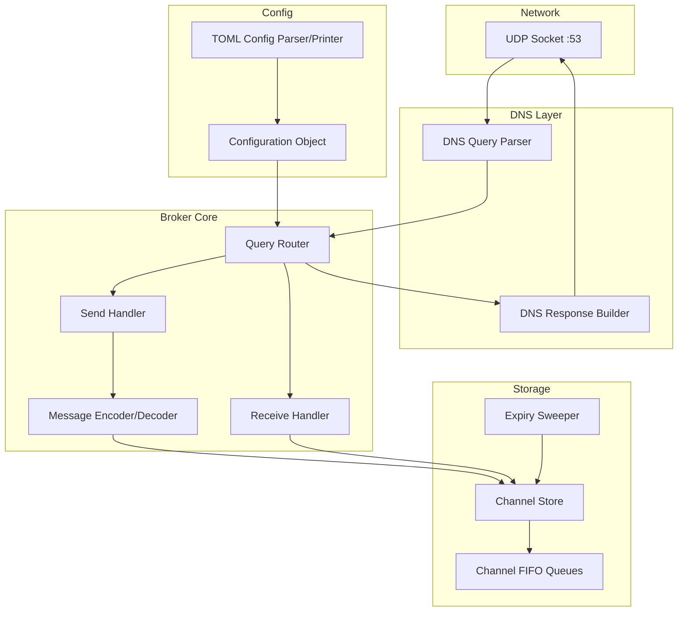

# Design Document: DNS Message Broker

## Overview

The DNS Message Broker is a daemon that acts as an authoritative DNS server for a controlled domain, repurposing DNS infrastructure as a lightweight datagram transport. Clients send messages by encoding payloads into DNS A query names and retrieve messages by issuing DNS TXT queries. The Broker stores messages in per-channel FIFO queues and serves them back as TXT records.

The system is intentionally simple:
- Messages are atomic datagrams — no fragmentation at the broker level.
- Retrieval is sequential FIFO pop — no parallel indexed reads or notify shortcuts.
- Cache busting relies on nonce-prefixed query names and TTL 0 on all responses.
- Clients poll for new messages via repeated TXT queries.
- CNAME response encoding is deferred to a future version.

The implementation language is Rust, chosen for its strong DNS library ecosystem (`trust-dns` / `hickory-dns`), safe concurrency, and suitability for long-running daemons.

## Architecture

The Broker follows a layered architecture with clear separation between DNS protocol handling, message encoding/decoding, and storage.



### Request Flow

1. UDP packet arrives on the listen socket.
2. DNS Query Parser decodes the raw bytes into a DNS message (RFC 1035).
3. Query Router inspects the query name:
   - If outside the Controlled_Domain → REFUSED.
   - If malformed → FORMERR.
   - If A/AAAA query → route to Send Handler.
   - If TXT query → route to Receive Handler.
4. Send Handler: strips nonce, parses sender/channel/payload labels, decodes base32 payload, stores message.
5. Receive Handler: strips nonce, identifies channel, pops oldest undelivered message, encodes as TXT envelope.
6. DNS Response Builder constructs the response and sends it back over UDP.

### Concurrency Model

The Broker runs a single-threaded async event loop (tokio). The Channel Store is behind an `Arc<RwLock<...>>` to allow the expiry sweeper task to run concurrently with query handling. Given the low-throughput nature of DNS-based messaging, this is sufficient.

## Components and Interfaces

### 1. Configuration (`config` module)

```rust
/// Broker configuration parsed from TOML.
struct Config {
    listen_addr: IpAddr,          // default: 0.0.0.0
    listen_port: u16,             // default: 53
    controlled_domain: Name,      // required, e.g. "broker.example.com"
    channel_inactivity_timeout: Duration,  // default: 1 hour
    max_messages_per_channel: usize,       // default: 100
    message_ttl: Duration,                 // default: 10 minutes
    expiry_interval: Duration,             // default: 30 seconds
    log_level: LevelFilter,               // default: info
    ack_ip: Ipv4Addr,                     // default: 1.2.3.4
    error_payload_too_large_ip: Ipv4Addr, // default: 1.2.3.5
    error_channel_full_ip: Ipv4Addr,      // default: 1.2.3.6
}

fn parse_config(toml_str: &str) -> Result<Config, ConfigError>;
fn print_config(config: &Config) -> String;
```

### 2. Message Encoder/Decoder (`encoding` module)

```rust
/// Decode a send query name into message components.
/// Input: labels after stripping nonce and controlled domain.
/// Layout: [payload_label_0, ..., payload_label_n, sender_id, channel]
fn decode_send_query(
    labels: &[&str],
    controlled_domain: &Name,
) -> Result<(String, String, Vec<u8>), DecodeError>;

/// Encode a stored message into a TXT envelope string.
/// Format: "<sender_id>|<seq>|<timestamp>|<base32_payload>"
fn encode_envelope(msg: &StoredMessage) -> String;

/// Decode a TXT envelope string back into components.
fn decode_envelope(envelope: &str) -> Result<EnvelopeParts, DecodeError>;

/// Base32 encode raw bytes (RFC 4648, lowercase, no padding).
fn base32_encode(data: &[u8]) -> String;

/// Base32 decode a string back to raw bytes.
fn base32_decode(encoded: &str) -> Result<Vec<u8>, DecodeError>;
```

### 3. Channel Store (`store` module)

```rust
/// Thread-safe message store keyed by channel name.
struct ChannelStore {
    channels: HashMap<String, Channel>,
    max_messages_per_channel: usize,
    channel_inactivity_timeout: Duration,
    message_ttl: Duration,
}

struct Channel {
    messages: VecDeque<StoredMessage>,
    last_activity: Instant,
}

struct StoredMessage {
    sender_id: String,
    payload: Vec<u8>,
    sequence: u64,
    timestamp: u64,       // epoch seconds
    expiry: Instant,
}

impl ChannelStore {
    /// Store a message. Returns Err if channel is full.
    fn push(&mut self, channel: &str, sender_id: &str, payload: Vec<u8>) -> Result<u64, StoreError>;

    /// Pop the oldest undelivered message from a channel.
    fn pop(&mut self, channel: &str) -> Option<StoredMessage>;

    /// Remove expired messages and inactive channels.
    fn sweep_expired(&mut self, now: Instant);
}
```

### 4. Query Router (`handler` module)

```rust
/// Route an incoming DNS query to the appropriate handler and produce a response.
fn handle_query(
    query: &DnsMessage,
    config: &Config,
    store: &mut ChannelStore,
) -> DnsResponse;
```

### 5. DNS Layer (`dns` module)

```rust
/// Parse raw UDP bytes into a DNS message.
fn parse_dns_query(bytes: &[u8]) -> Result<DnsMessage, DnsError>;

/// Build a DNS response with the given rcode and answer records.
fn build_response(
    query_id: u16,
    query_name: &Name,
    query_type: RecordType,
    rcode: ResponseCode,
    answers: Vec<Record>,
) -> Vec<u8>;
```

### 6. Daemon (`main` / `server` module)

```rust
/// Entry point: parse CLI args, load config, bind socket, run event loop.
async fn run(config_path: &Path) -> Result<(), Box<dyn Error>>;
```

## Data Models

### StoredMessage

| Field       | Type      | Description                                      |
|-------------|-----------|--------------------------------------------------|
| sender_id   | String    | Identifier of the sending client (max 63 chars)  |
| payload     | Vec<u8>   | Raw message bytes (decoded from base32)          |
| sequence    | u64       | Monotonically increasing per-broker sequence     |
| timestamp   | u64       | Unix epoch seconds when the message was stored   |
| expiry      | Instant   | When this message should be garbage collected     |

### Channel

| Field          | Type                    | Description                              |
|----------------|-------------------------|------------------------------------------|
| messages       | VecDeque<StoredMessage> | FIFO queue of pending messages           |
| last_activity  | Instant                 | Last send or receive on this channel     |

### Envelope (wire format)

TXT record data is a pipe-delimited string:

```
<sender_id>|<sequence_number>|<timestamp_epoch_seconds>|<base32_payload>
```

Example: `alice|42|1718000000|nbswy3dp`

### Send Query Name Structure

```
<nonce>.<base32_payload_label_0>.<base32_payload_label_1>...<sender_id>.<channel>.<controlled_domain>
```

Labels are read right-to-left: controlled domain labels first, then channel (1 label), then sender_id (1 label), then payload labels (1+), then nonce (1 label, leftmost).

### Receive Query Name Structure

```
<nonce>.<channel>.<controlled_domain>
```

### DNS Response Codes

| Scenario                        | Response                                    |
|---------------------------------|---------------------------------------------|
| Send success                    | A record: `ack_ip` (default `1.2.3.4`)     |
| Payload too large               | A record: `error_payload_too_large_ip`      |
| Channel full                    | A record: `error_channel_full_ip`           |
| Receive with message available  | TXT record: envelope string, TTL 0         |
| Receive with empty channel      | NOERROR, zero answer records                |
| Query outside controlled domain | REFUSED                                     |
| Malformed DNS packet            | FORMERR                                     |
| Unparseable query structure     | NXDOMAIN                                    |


## Correctness Properties

*A property is a characteristic or behavior that should hold true across all valid executions of a system — essentially, a formal statement about what the system should do. Properties serve as the bridge between human-readable specifications and machine-verifiable correctness guarantees.*

### Property 1: Base32 round-trip

*For any* byte sequence, base32-encoding then base32-decoding it should produce the original byte sequence.

**Validates: Requirements 5.2**

### Property 2: Envelope encoding round-trip

*For any* valid StoredMessage (with arbitrary sender_id, sequence number, timestamp, and payload), encoding it as an envelope string and then decoding that string should produce equivalent components.

**Validates: Requirements 5.3**

### Property 3: Configuration round-trip

*For any* valid Configuration object, printing it to TOML and then parsing the resulting TOML should produce an equivalent Configuration object.

**Validates: Requirements 7.7**

### Property 4: Full message round-trip

*For any* valid message payload, sender_id, and channel name that fit within the payload budget, encoding the message into a send query name, having the Broker parse and store it, then retrieving it via a TXT query and decoding the envelope should produce a payload identical to the original.

**Validates: Requirements 5.6**

### Property 5: Authoritative answer for controlled domain

*For any* DNS query whose name is a subdomain of the Controlled_Domain, the Broker's response should have the AA (Authoritative Answer) flag set.

**Validates: Requirements 1.2**

### Property 6: REFUSED for queries outside controlled domain

*For any* DNS query whose name is not a subdomain of the Controlled_Domain, the Broker should respond with rcode REFUSED.

**Validates: Requirements 1.3**

### Property 7: Send stores message and returns acknowledgment

*For any* valid send query (payload within budget, channel not full), the Broker should store the message in the target channel AND respond with an A record containing the configured acknowledgment IP address.

**Validates: Requirements 2.1, 2.3**

### Property 8: Monotonically increasing sequence numbers

*For any* sequence of N successfully stored messages (across any combination of channels), the sequence numbers assigned to those messages should be strictly increasing in the order they were stored.

**Validates: Requirements 2.5**

### Property 9: FIFO pop semantics

*For any* channel with N pending messages, successive pop operations should return messages in the order they were inserted, and each popped message should not be returned by any subsequent pop.

**Validates: Requirements 3.1, 3.4**

### Property 10: TTL zero on all responses

*For any* DNS response produced by the Broker that contains answer records, every record's TTL should be 0.

**Validates: Requirements 3.5, 9.1**

### Property 11: Channel full enforcement

*For any* channel that has reached the configured maximum message count, attempting to send an additional message should fail and the Broker should respond with the configured channel-full error IP address, leaving the channel contents unchanged.

**Validates: Requirements 4.3, 4.4**

### Property 12: Default configuration values

*For any* valid TOML configuration string that specifies only the required `controlled_domain` field and omits all optional fields, parsing it should produce a Configuration object where every optional field equals its documented default value.

**Validates: Requirements 7.3**

### Property 13: Nonce label invariants

*For any* generated Nonce_Label, it should be at least 8 characters long and consist entirely of alphanumeric characters.

**Validates: Requirements 9.2, 9.3**

### Property 14: Expiry sweep removes expired messages

*For any* set of stored messages with known expiry times, after advancing time past those expiry times and running a sweep, none of the expired messages should remain in the store, and all non-expired messages should be preserved.

**Validates: Requirements 8.1, 8.2**

### Property 15: Inactivity timeout removes channels

*For any* channel with no send or receive activity, after advancing time past the configured inactivity timeout and running a sweep, the channel should no longer exist in the store.

**Validates: Requirements 4.2**

### Property 16: Envelope contains all required fields

*For any* StoredMessage, the encoded envelope string should contain the sender_id, sequence number, timestamp, and base32-encoded payload as distinct pipe-delimited fields.

**Validates: Requirements 3.2**

## Error Handling

### DNS-Level Errors

| Error Condition                          | Response                          |
|------------------------------------------|-----------------------------------|
| Malformed DNS packet (unparseable bytes) | FORMERR rcode                     |
| Query name outside Controlled_Domain     | REFUSED rcode                     |
| Query name structure unparseable         | NXDOMAIN rcode                    |
| Payload exceeds budget                   | A record with error IP (1.2.3.5)  |
| Channel at max capacity                  | A record with error IP (1.2.3.6)  |

### Application-Level Errors

| Error Condition                    | Behavior                                              |
|------------------------------------|-------------------------------------------------------|
| Config file missing or invalid     | Log descriptive error, exit with non-zero code        |
| Port bind failure                  | Log error, exit with non-zero code                    |
| Base32 decode failure              | Treat as unparseable query → NXDOMAIN                 |
| Envelope decode failure            | Return error to caller (client-side)                  |

### Graceful Shutdown

On SIGTERM/SIGINT, the Broker:
1. Stops accepting new UDP packets.
2. Finishes processing any in-flight query (single-threaded, so at most one).
3. Exits within 5 seconds.

No persistence of in-memory messages is performed on shutdown — messages are ephemeral by design.

## Testing Strategy

### Unit Tests

Unit tests cover specific examples, edge cases, and error conditions:

- **Base32 encoding**: Known test vectors (empty input, single byte, multi-byte).
- **Envelope encoding/decoding**: Known envelope strings with expected parsed components.
- **Config parsing**: Valid TOML with all fields, minimal TOML with only required fields, invalid TOML.
- **Send query parsing**: Known query names with expected extracted components.
- **Error responses**: Malformed packets → FORMERR, outside domain → REFUSED, bad structure → NXDOMAIN, oversized payload → error IP, full channel → error IP.
- **Empty channel receive**: TXT query on empty channel returns NOERROR with zero answers.
- **Channel auto-creation**: Sending to a non-existent channel creates it.
- **Nonce stripping**: Queries with and without nonce labels parse equivalently (after stripping).

### Property-Based Tests

Property-based tests use the `proptest` crate (Rust) with a minimum of 100 iterations per property. Each test references its design document property.

| Test | Property | Tag |
|------|----------|-----|
| `test_base32_roundtrip` | Property 1 | Feature: dns-message-broker, Property 1: Base32 round-trip |
| `test_envelope_roundtrip` | Property 2 | Feature: dns-message-broker, Property 2: Envelope encoding round-trip |
| `test_config_roundtrip` | Property 3 | Feature: dns-message-broker, Property 3: Configuration round-trip |
| `test_full_message_roundtrip` | Property 4 | Feature: dns-message-broker, Property 4: Full message round-trip |
| `test_authoritative_flag` | Property 5 | Feature: dns-message-broker, Property 5: Authoritative answer for controlled domain |
| `test_refused_outside_domain` | Property 6 | Feature: dns-message-broker, Property 6: REFUSED for queries outside controlled domain |
| `test_send_stores_and_acks` | Property 7 | Feature: dns-message-broker, Property 7: Send stores message and returns acknowledgment |
| `test_monotonic_sequence` | Property 8 | Feature: dns-message-broker, Property 8: Monotonically increasing sequence numbers |
| `test_fifo_pop` | Property 9 | Feature: dns-message-broker, Property 9: FIFO pop semantics |
| `test_ttl_zero` | Property 10 | Feature: dns-message-broker, Property 10: TTL zero on all responses |
| `test_channel_full` | Property 11 | Feature: dns-message-broker, Property 11: Channel full enforcement |
| `test_config_defaults` | Property 12 | Feature: dns-message-broker, Property 12: Default configuration values |
| `test_nonce_invariants` | Property 13 | Feature: dns-message-broker, Property 13: Nonce label invariants |
| `test_expiry_sweep` | Property 14 | Feature: dns-message-broker, Property 14: Expiry sweep removes expired messages |
| `test_inactivity_timeout` | Property 15 | Feature: dns-message-broker, Property 15: Inactivity timeout removes channels |
| `test_envelope_fields` | Property 16 | Feature: dns-message-broker, Property 16: Envelope contains all required fields |

### Test Configuration

- **Property-based testing library**: `proptest` crate
- **Minimum iterations**: 100 per property test (configured via `proptest! { #![proptest_config(ProptestConfig::with_cases(100))] ... }`)
- **Each property test must be tagged** with a comment: `// Feature: dns-message-broker, Property N: <title>`
- **Each correctness property is implemented by a single property-based test**
- **Time-dependent tests** (Properties 14, 15) use a `Clock` trait to inject a mock clock, avoiding real time dependencies
- **Unit tests and property tests are complementary**: unit tests catch concrete edge cases, property tests verify universal correctness across randomized inputs
