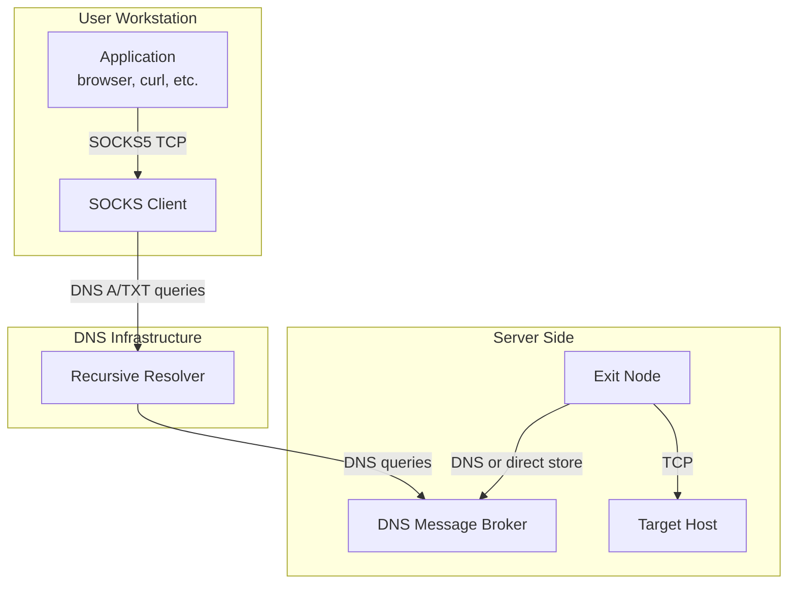
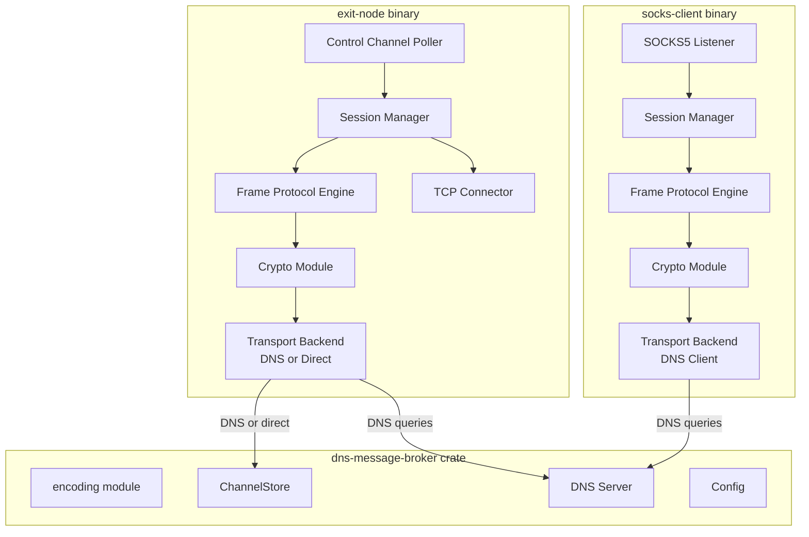
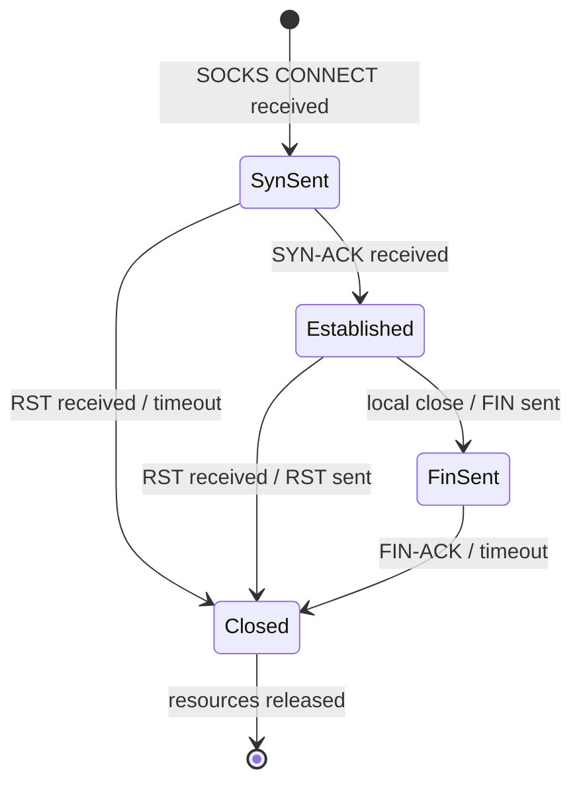
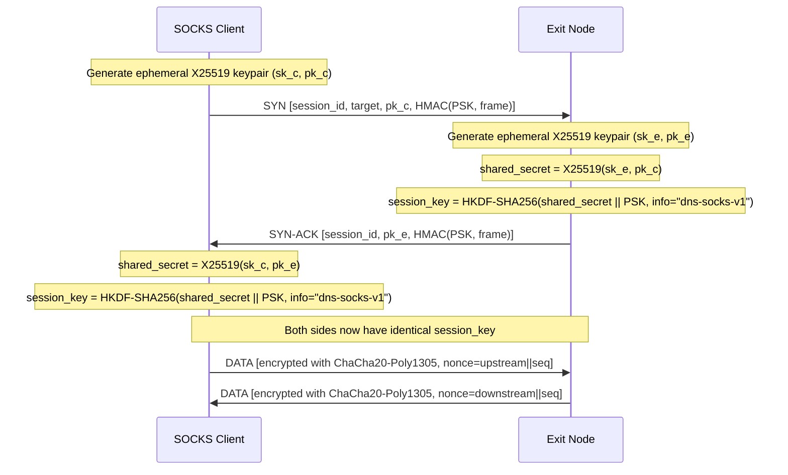
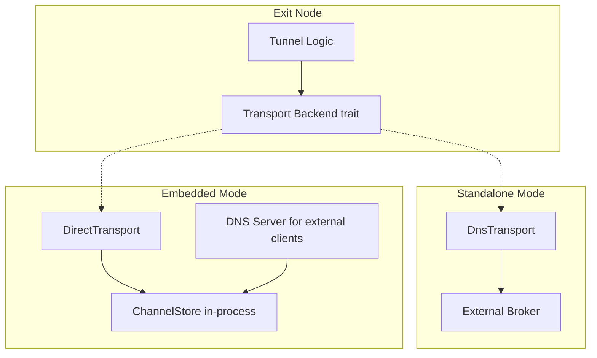

# Design Document: DNS SOCKS Proxy

## Overview

This feature builds a TCP-over-DNS tunnel using the existing DNS Message Broker as transport. Two new binaries — `socks-client` and `exit-node` — cooperate to proxy TCP connections through DNS queries. The SOCKS Client exposes a standard SOCKS5 interface on localhost; applications connect to it as a normal proxy. Instead of making direct TCP connections, the SOCKS Client fragments outbound TCP data into small frames, encrypts them, encodes them as DNS queries, and sends them through the Broker. The Exit Node polls the Broker, reassembles frames, makes the actual TCP connections, and returns response data the same way in reverse.

The Broker itself is unchanged. All tunnel complexity (session management, framing, reliability, encryption, fragmentation) lives in the two new binaries. They depend on the `dns-message-broker` crate as a library for encoding utilities and, in embedded mode, for direct ChannelStore access.

Key design decisions:

- **Lightweight TCP-over-DNS**: A minimal reliable-delivery protocol with sequence numbers, ACKs, retransmission, and sliding-window flow control, designed for the ~80–131 byte payload budget of DNS messages.
- **Per-session encryption**: X25519 ephemeral key exchange authenticated by a PSK, deriving ChaCha20-Poly1305 session keys. DATA frames are encrypted; control frames (SYN/SYN-ACK/FIN/RST/ACK) are HMAC-authenticated.
- **Transport_Backend trait**: Abstracts DNS-based vs direct ChannelStore access, enabling the Exit Node to run in embedded mode (Broker in-process) or standalone mode (Broker over DNS).
- **No Broker modifications**: The Broker remains a simple per-channel FIFO datagram store.

## Architecture



### Component Architecture



### Request Flow (SOCKS CONNECT)

1. Application connects to SOCKS Client on `127.0.0.1:1080`.
2. SOCKS5 handshake: client offers NO AUTH, server accepts.
3. SOCKS5 CONNECT request: client sends target host + port.
4. SOCKS Client generates Session_ID, creates upstream/downstream channels.
5. SOCKS Client generates X25519 ephemeral keypair.
6. SOCKS Client sends SYN frame (Session_ID + target + public key + HMAC) on Control_Channel.
7. Exit Node receives SYN, generates its own X25519 keypair, computes shared secret, derives Session_Key.
8. Exit Node opens TCP connection to target host.
9. Exit Node sends SYN-ACK frame (Session_ID + public key + HMAC) on Control_Channel.
10. SOCKS Client receives SYN-ACK, computes shared secret, derives Session_Key.
11. SOCKS Client sends SOCKS5 success reply to application.
12. Bidirectional data flow: TCP data is fragmented → encrypted → framed → sent as DNS queries. Reverse path reassembles.
13. Either side sends FIN to close; RST for abort.

### Concurrency Model

Both binaries use tokio async runtime. Each session spawns:
- An upstream task (reading local TCP → fragmenting → sending frames)
- A downstream task (polling for frames → reassembling → writing local TCP)
- A retransmission timer task

The Session Manager coordinates session lifecycle. The Transport Backend is shared across sessions via `Arc`.

## Components and Interfaces

### 1. SOCKS5 Listener (`socks` module)

Handles the SOCKS5 protocol handshake and CONNECT command parsing.

```rust
/// Parsed SOCKS5 CONNECT request.
pub struct ConnectRequest {
    pub target_addr: TargetAddr,
    pub target_port: u16,
}

/// Target address types per RFC 1928.
pub enum TargetAddr {
    Ipv4([u8; 4]),
    Ipv6([u8; 16]),
    Domain(String),
}

/// Perform SOCKS5 handshake on a TCP stream.
/// Returns the CONNECT request or an error.
async fn socks5_handshake(stream: &mut TcpStream) -> Result<ConnectRequest, SocksError>;

/// Send SOCKS5 reply (success or error code).
async fn socks5_reply(stream: &mut TcpStream, reply: u8, bind_addr: SocketAddr) -> io::Result<()>;
```

### 2. Session Manager (`session` module)

Manages the lifecycle of tunnel sessions.

```rust
/// Unique session identifier (8 random alphanumeric characters).
pub struct SessionId([u8; 8]);

impl SessionId {
    pub fn generate() -> Self;
    pub fn as_str(&self) -> &str;
}

/// Session state machine.
pub enum SessionState {
    SynSent,        // SYN sent, waiting for SYN-ACK
    Established,    // Data flowing
    FinSent,        // FIN sent, waiting for acknowledgment
    Closed,         // Terminal state
}

/// A single tunnel session.
pub struct Session {
    pub id: SessionId,
    pub state: SessionState,
    pub target: ConnectRequest,
    pub upstream_channel: String,   // "u-<session_id>"
    pub downstream_channel: String, // "d-<session_id>"
    pub tx_seq: u32,                // Next sequence number to send
    pub rx_next: u32,               // Next expected sequence number
    pub session_key: Option<SessionKey>,
    pub retransmit_buf: RetransmitBuffer,
    pub reassembly_buf: ReassemblyBuffer,
}

/// Session manager holding all active sessions.
pub struct SessionManager {
    sessions: HashMap<SessionId, Session>,
    max_sessions: usize, // default: 64
}

impl SessionManager {
    pub fn create_session(&mut self, target: ConnectRequest) -> Result<&mut Session, SessionError>;
    pub fn get_session(&mut self, id: &SessionId) -> Option<&mut Session>;
    pub fn remove_session(&mut self, id: &SessionId);
    pub fn active_count(&self) -> usize;
}
```

### 3. Frame Protocol (`frame` module)

Defines the binary frame format and encoder/decoder.

```rust
/// Frame types.
#[repr(u8)]
pub enum FrameType {
    Data    = 0x01,
    Ack     = 0x02,
    Syn     = 0x03,
    SynAck  = 0x04,
    Fin     = 0x05,
    Rst     = 0x06,
}

/// Frame flags (bitfield).
pub struct FrameFlags(u8);

/// A tunnel frame.
pub struct Frame {
    pub session_id: SessionId,
    pub seq: u32,
    pub frame_type: FrameType,
    pub flags: FrameFlags,
    pub payload: Vec<u8>,
}

/// Encode a Frame into bytes.
pub fn encode_frame(frame: &Frame) -> Vec<u8>;

/// Decode bytes into a Frame.
pub fn decode_frame(data: &[u8]) -> Result<Frame, FrameError>;
```

#### Wire Format

```
+-------------------+------------------+------------+-------+-----------+
| session_id_len(1) | session_id(var)  | seq(4, BE) | type(1)| flags(1) |
+-------------------+------------------+------------+-------+-----------+
| payload (remaining bytes)                                              |
+------------------------------------------------------------------------+
```

- `session_id_len`: 1 byte, length of session_id field (always 8 for this implementation)
- `session_id`: variable length (8 bytes), ASCII alphanumeric
- `seq`: 4 bytes, big-endian u32 sequence number
- `type`: 1 byte, FrameType discriminant
- `flags`: 1 byte, reserved for future use (currently 0x00)
- `payload`: remaining bytes, content depends on frame type

Total header overhead: 1 + 8 + 4 + 1 + 1 = **15 bytes**

### 4. Reliable Delivery (`reliability` module)

Implements ACK tracking, retransmission, and sliding window flow control.

```rust
/// Retransmission buffer: holds sent-but-unacknowledged frames.
pub struct RetransmitBuffer {
    frames: BTreeMap<u32, RetransmitEntry>,
    window_size: usize,     // default: 8
    max_retransmits: usize, // default: 10
    rto: Duration,          // default: 2s
}

pub struct RetransmitEntry {
    pub frame: Frame,
    pub sent_at: Instant,
    pub retransmit_count: usize,
}

impl RetransmitBuffer {
    /// Queue a frame for retransmission tracking.
    pub fn insert(&mut self, seq: u32, frame: Frame);

    /// Acknowledge all frames up to and including `ack_seq`.
    /// Returns the number of frames removed.
    pub fn acknowledge(&mut self, ack_seq: u32) -> usize;

    /// Returns frames that need retransmission (past RTO).
    pub fn get_retransmittable(&self, now: Instant) -> Vec<&Frame>;

    /// Returns true if the window is full (cannot send more).
    pub fn is_window_full(&self) -> bool;

    /// Check if any frame has exceeded max retransmissions.
    pub fn has_exceeded_max_retransmits(&self) -> Option<u32>;
}

/// Reassembly buffer: reorders received frames and delivers contiguous data.
pub struct ReassemblyBuffer {
    buffer: BTreeMap<u32, Vec<u8>>,
    next_expected: u32,
    max_buffer_size: usize, // default: 32
}

impl ReassemblyBuffer {
    /// Insert a received DATA frame payload.
    /// Returns true if the frame was new (not a duplicate).
    pub fn insert(&mut self, seq: u32, payload: Vec<u8>) -> bool;

    /// Drain contiguous payloads starting from next_expected.
    /// Returns concatenated bytes and updates next_expected.
    pub fn drain_contiguous(&mut self) -> Vec<u8>;

    /// Returns the highest contiguous sequence number received.
    pub fn ack_seq(&self) -> u32;

    /// Returns true if buffer has exceeded max size.
    pub fn is_overflowed(&self) -> bool;
}
```

### 5. Crypto Module (`crypto` module)

Handles key exchange, key derivation, and frame encryption/authentication.

```rust
use x25519_dalek::{EphemeralSecret, PublicKey, SharedSecret};

/// Pre-shared key (minimum 32 bytes).
pub struct Psk(Vec<u8>);

impl Psk {
    pub fn from_bytes(bytes: Vec<u8>) -> Result<Self, CryptoError>;
    pub fn from_file(path: &Path) -> Result<Self, CryptoError>;
}

/// Per-session symmetric key material derived from DH + PSK.
pub struct SessionKey {
    /// ChaCha20-Poly1305 key for DATA frame encryption (32 bytes).
    pub data_key: [u8; 32],
    /// HMAC-SHA256 key for control frame authentication (32 bytes).
    pub control_key: [u8; 32],
}

/// Direction of data flow, used in nonce derivation.
pub enum Direction {
    Upstream,   // SOCKS_Client → Exit_Node
    Downstream, // Exit_Node → SOCKS_Client
}

/// Generate an X25519 ephemeral keypair.
pub fn generate_keypair() -> (EphemeralSecret, PublicKey);

/// Derive session keys from DH shared secret + PSK.
/// Uses HKDF-SHA256 with info string "dns-socks-v1".
pub fn derive_session_key(shared_secret: &SharedSecret, psk: &Psk) -> SessionKey;

/// Encrypt a DATA frame payload using ChaCha20-Poly1305.
/// Nonce = direction_byte || zero_padding(3) || seq_be(4) || zero_padding(4)
pub fn encrypt_data(
    key: &SessionKey,
    seq: u32,
    direction: Direction,
    plaintext: &[u8],
) -> Vec<u8>; // ciphertext + 16-byte tag

/// Decrypt a DATA frame payload using ChaCha20-Poly1305.
pub fn decrypt_data(
    key: &SessionKey,
    seq: u32,
    direction: Direction,
    ciphertext: &[u8],
) -> Result<Vec<u8>, CryptoError>;

/// Compute HMAC-SHA256 over a control frame, truncated to 16 bytes.
pub fn compute_control_mac(psk: &Psk, frame_bytes: &[u8]) -> [u8; 16];

/// Verify HMAC-SHA256 on a control frame.
pub fn verify_control_mac(psk: &Psk, frame_bytes: &[u8], mac: &[u8; 16]) -> bool;
```

### 6. Transport Backend (`transport` module)

Abstracts how frames are sent to and received from the Broker.

```rust
/// Trait abstracting Broker communication.
#[async_trait]
pub trait TransportBackend: Send + Sync {
    /// Send a frame to the specified channel.
    async fn send_frame(&self, channel: &str, sender_id: &str, frame_bytes: &[u8]) -> Result<(), TransportError>;

    /// Receive the next frame from the specified channel.
    /// Returns None if the channel is empty.
    async fn recv_frame(&self, channel: &str) -> Result<Option<Vec<u8>>, TransportError>;
}

/// DNS-based transport: sends/receives via DNS A/TXT queries.
pub struct DnsTransport {
    resolver_addr: SocketAddr,
    controlled_domain: String,
    socket: UdpSocket,
}

#[async_trait]
impl TransportBackend for DnsTransport {
    async fn send_frame(&self, channel: &str, sender_id: &str, frame_bytes: &[u8]) -> Result<(), TransportError>;
    async fn recv_frame(&self, channel: &str) -> Result<Option<Vec<u8>>, TransportError>;
}

/// Direct ChannelStore transport: bypasses DNS, calls store directly.
pub struct DirectTransport {
    store: SharedStore, // Arc<RwLock<ChannelStore<RealClock>>>
    sender_id: String,
}

#[async_trait]
impl TransportBackend for DirectTransport {
    async fn send_frame(&self, channel: &str, sender_id: &str, frame_bytes: &[u8]) -> Result<(), TransportError>;
    async fn recv_frame(&self, channel: &str) -> Result<Option<Vec<u8>>, TransportError>;
}
```

### 7. Configuration (`config` module in each binary)

```rust
/// SOCKS Client configuration.
pub struct SocksClientConfig {
    pub listen_addr: IpAddr,          // default: 127.0.0.1
    pub listen_port: u16,             // default: 1080
    pub controlled_domain: String,    // required
    pub resolver_addr: SocketAddr,    // required
    pub client_id: String,            // required
    pub psk: Psk,                     // required (--psk or --psk-file)
    pub rto: Duration,                // default: 2s
    pub max_retransmits: usize,       // default: 10
    pub window_size: usize,           // default: 8
    pub poll_active: Duration,        // default: 50ms
    pub poll_idle: Duration,          // default: 500ms
}

/// Exit Node configuration.
pub struct ExitNodeConfig {
    pub controlled_domain: String,    // required
    pub resolver_addr: Option<SocketAddr>, // required in standalone mode
    pub node_id: String,              // required
    pub psk: Psk,                     // required
    pub mode: DeploymentMode,         // default: Standalone
    pub broker_config_path: Option<PathBuf>, // required in embedded mode
    pub rto: Duration,                // default: 2s
    pub max_retransmits: usize,       // default: 10
    pub window_size: usize,           // default: 8
    pub poll_active: Duration,        // default: 50ms
    pub poll_idle: Duration,          // default: 500ms
    pub connect_timeout: Duration,    // default: 10s
}

pub enum DeploymentMode {
    Standalone,
    Embedded,
}
```

## Data Models

### Frame Wire Format

#### Common Header (15 bytes)

| Offset | Size | Field | Description |
|--------|------|-------|-------------|
| 0 | 1 | `session_id_len` | Length of session_id (always 8) |
| 1 | 8 | `session_id` | ASCII alphanumeric session identifier |
| 9 | 4 | `seq` | Big-endian u32 sequence number |
| 13 | 1 | `type` | FrameType discriminant |
| 14 | 1 | `flags` | Reserved flags byte |

#### DATA Frame Payload

After encryption, the payload is:
```
[encrypted_chunk (variable)] [poly1305_tag (16 bytes)]
```

Effective payload budget per DATA frame:
```
payload_budget = broker_payload_budget - 15 (header) - 16 (poly1305 tag)
```

For typical configurations (~131 byte broker budget): 131 - 15 - 16 = **100 bytes** of plaintext per frame.

#### SYN Frame Payload

```
+----------+------------------+----------+-------------------+---------+
| addr_type(1) | address(var) | port(2,BE) | x25519_pubkey(32) | mac(16) |
+----------+------------------+----------+-------------------+---------+
```

- `addr_type`: `0x01` (IPv4, 4 bytes), `0x03` (domain, 1-byte length prefix + domain), `0x04` (IPv6, 16 bytes)
- `address`: target address bytes
- `port`: big-endian u16 target port
- `x25519_pubkey`: 32-byte ephemeral public key
- `mac`: truncated 16-byte HMAC-SHA256 over the entire frame (header + payload before mac)

#### SYN-ACK Frame Payload

```
+-------------------+---------+
| x25519_pubkey(32) | mac(16) |
+-------------------+---------+
```

#### FIN / RST Frame Payload

```
+-------------------+---------+
| reason(var, opt)  | mac(16) |
+-------------------+---------+
```

- `reason`: optional UTF-8 error description (RST only)
- `mac`: truncated 16-byte HMAC-SHA256

#### ACK Frame Payload

```
+----------------+---------+
| ack_seq(4, BE) | mac(16) |
+----------------+---------+
```

- `ack_seq`: highest contiguous sequence number received

### Channel Naming

| Channel | Format | Example |
|---------|--------|---------|
| Upstream | `u-<session_id>` | `u-a1b2c3d4` |
| Downstream | `d-<session_id>` | `d-a1b2c3d4` |
| Control | `ctl-<client_id>` | `ctl-myclient` |

All channel names fit within a single DNS label (max 63 chars). Session_ID is exactly 8 alphanumeric characters, so the longest channel name is `ctl-` + client_id (client_id must be ≤ 59 chars).

### Session State Machine



### Encryption Protocol



#### Key Derivation

```
ikm = X25519_shared_secret (32 bytes) || PSK (≥32 bytes)
prk = HKDF-Extract(salt=empty, ikm)
okm = HKDF-Expand(prk, info="dns-socks-v1", length=64)
data_key = okm[0..32]     // ChaCha20-Poly1305 key
control_key = okm[32..64] // HMAC-SHA256 key (post-handshake control frames)
```

#### Nonce Construction (12 bytes for ChaCha20-Poly1305)

```
nonce[0]    = direction (0x00 = upstream, 0x01 = downstream)
nonce[1..4] = 0x00 0x00 0x00 (padding)
nonce[4..8] = seq (big-endian u32)
nonce[8..12] = 0x00 0x00 0x00 0x00 (padding)
```

Direction byte ensures the same sequence number in different directions produces different nonces, preventing nonce reuse.

### Payload Budget Calculation

```
broker_budget = floor((253 - len(domain) - len(nonce) - len(sender_id) - len(channel) - 4 dots - extra_label_dots) * 5 / 8)

frame_header = 15 bytes
encryption_overhead = 16 bytes (Poly1305 tag, DATA frames only)
control_mac = 16 bytes (HMAC, control frames only)

effective_data_payload = broker_budget - frame_header - encryption_overhead
effective_control_payload = broker_budget - frame_header - control_mac
```

### Transport Backend Abstraction



In embedded mode, the Exit Node:
1. Loads the Broker's TOML config
2. Creates a `ChannelStore` in-process
3. Wraps it in `Arc<RwLock<...>>` (the existing `SharedStore` type)
4. Starts the Broker's DNS server loop (serving external SOCKS Client queries) sharing the same store
5. Starts the Broker's expiry sweeper task
6. Uses `DirectTransport` for its own frame send/recv, bypassing DNS serialization

## Correctness Properties

*A property is a characteristic or behavior that should hold true across all valid executions of a system — essentially, a formal statement about what the system should do. Properties serve as the bridge between human-readable specifications and machine-verifiable correctness guarantees.*

### Property 1: SOCKS5 CONNECT request round-trip

*For any* valid target address (IPv4, IPv6, or domain name) and target port, encoding a SOCKS5 CONNECT request into bytes and then parsing those bytes should produce the same target address and port.

**Validates: Requirements 1.3**

### Property 2: Non-CONNECT commands rejected

*For any* SOCKS5 request with a command byte other than `0x01` (CONNECT), the SOCKS5 parser should return an error indicating "command not supported" with reply code `0x07`.

**Validates: Requirements 1.4**

### Property 3: Session_ID format and uniqueness

*For any* batch of generated Session_IDs, each should be exactly 8 characters long, consist entirely of alphanumeric characters, and no two Session_IDs in the batch should be equal.

**Validates: Requirements 2.1, 9.2**

### Property 4: Session cleanup releases resources

*For any* session that is created in the SessionManager and then removed (via FIN, RST, or explicit removal), the SessionManager's active session count should decrease by one and the session should no longer be retrievable by its ID.

**Validates: Requirements 2.10**

### Property 5: Frame encoding round-trip

*For any* valid Frame struct (with any FrameType, valid Session_ID, arbitrary sequence number, flags, and payload), encoding the Frame to bytes and then decoding those bytes should produce an equivalent Frame struct.

**Validates: Requirements 3.8, 11.3**

### Property 6: SYN frame target address round-trip

*For any* valid target address (IPv4, IPv6, or domain name) and target port, encoding them into a SYN frame payload and then decoding that payload should produce the same address type, address, and port.

**Validates: Requirements 3.5**

### Property 7: Monotonically increasing sequence numbers

*For any* session, the sequence numbers assigned to consecutive DATA frames by the sender should be strictly increasing (each greater than the previous by exactly 1).

**Validates: Requirements 4.1**

### Property 8: Reassembly buffer delivers in order

*For any* permutation of DATA frames with sequence numbers 0..N inserted into a ReassemblyBuffer, calling `drain_contiguous` after all insertions should produce payload bytes concatenated in the original sequence order (0, 1, 2, ..., N).

**Validates: Requirements 4.2**

### Property 9: ACK sequence equals highest contiguous

*For any* set of sequence numbers inserted into a ReassemblyBuffer, `ack_seq()` should return the highest sequence number S such that all sequence numbers from 0 to S (inclusive) are present in the buffer or have been drained.

**Validates: Requirements 4.3**

### Property 10: Retransmission triggers past RTO

*For any* frame in the RetransmitBuffer whose `sent_at + rto < now`, that frame should appear in the set returned by `get_retransmittable(now)`. Frames whose `sent_at + rto >= now` should not appear.

**Validates: Requirements 4.4**

### Property 11: Duplicate frame detection

*For any* sequence number already present in the ReassemblyBuffer (either buffered or already drained), inserting a frame with that same sequence number should return `false` (duplicate) and the buffer contents should remain unchanged.

**Validates: Requirements 4.6**

### Property 12: Window full enforcement

*For any* RetransmitBuffer, `is_window_full()` should return `true` if and only if the number of unacknowledged entries equals or exceeds the configured window size.

**Validates: Requirements 4.7**

### Property 13: Payload budget computation

*For any* combination of controlled domain length, sender_id length, channel name length, and nonce length (all within DNS label limits), the computed effective payload budget should equal `floor((253 - total_overhead - extra_label_dots) * 5 / 8) - frame_header_size - encryption_overhead`, and should always be non-negative.

**Validates: Requirements 5.7**

### Property 14: Fragmentation and reassembly round-trip

*For any* byte sequence of arbitrary length and any positive payload budget, splitting the byte sequence into chunks of at most `payload_budget` bytes and then concatenating those chunks in order should produce the original byte sequence.

**Validates: Requirements 6.1, 6.2**

### Property 15: Reassembly buffer overflow detection

*For any* ReassemblyBuffer with `max_buffer_size = M`, inserting more than M out-of-order frames (none contiguous with `next_expected`) should cause `is_overflowed()` to return `true`. Inserting M or fewer should return `false`.

**Validates: Requirements 6.4**

### Property 16: Channel naming convention and DNS label fit

*For any* valid Session_ID (8 alphanumeric chars) and Client_ID (≤ 59 chars, alphanumeric), the upstream channel `u-<session_id>`, downstream channel `d-<session_id>`, and control channel `ctl-<client_id>` should each be at most 63 characters and match the expected format pattern.

**Validates: Requirements 9.1, 9.3**

### Property 17: Session isolation

*For any* SessionManager with N active sessions, removing one session should leave exactly N-1 sessions, and all remaining sessions should be retrievable by their IDs with their state unchanged.

**Validates: Requirements 10.4**

### Property 18: Key derivation determinism

*For any* X25519 shared secret and PSK, calling `derive_session_key` twice with the same inputs should produce identical `data_key` and `control_key` values. Calling it with a different shared secret or different PSK should produce different keys.

**Validates: Requirements 12.4**

### Property 19: Encryption round-trip

*For any* plaintext, valid SessionKey, sequence number, and direction, encrypting the plaintext with `encrypt_data` and then decrypting the result with `decrypt_data` using the same key, sequence number, and direction should produce the original plaintext.

**Validates: Requirements 12.5**

### Property 20: HMAC compute/verify round-trip

*For any* PSK and frame byte sequence, computing the control MAC with `compute_control_mac` and then verifying it with `verify_control_mac` using the same PSK and frame bytes should return `true`. Verifying with a different PSK or modified frame bytes should return `false`.

**Validates: Requirements 12.9**

### Property 21: PSK minimum length enforcement

*For any* byte sequence shorter than 32 bytes, `Psk::from_bytes` should return an error. *For any* byte sequence of 32 or more bytes, `Psk::from_bytes` should succeed.

**Validates: Requirements 12.11**

### Property 22: Transport backend equivalence

*For any* frame byte sequence, sending it via `DirectTransport` (push to ChannelStore) and then receiving it (pop from ChannelStore) should produce the same byte sequence as sending via `DnsTransport` through the Broker and receiving via TXT query decode.

**Validates: Requirements 13.6**

## Error Handling

### SOCKS5 Layer

| Error Condition | Response |
|----------------|----------|
| Unsupported SOCKS version | Close TCP connection |
| Unsupported auth method | Reply with `0xFF` (no acceptable methods), close |
| Non-CONNECT command | Reply `0x07` (command not supported), close |
| Malformed request | Close TCP connection |
| Target unreachable (RST from Exit Node) | Reply `0x05` (connection refused), close |
| Session setup timeout | Reply `0x04` (host unreachable), close |

### Frame Protocol Layer

| Error Condition | Response |
|----------------|----------|
| Frame decode failure (short/invalid) | Discard frame, log at debug |
| Duplicate sequence number | Discard silently |
| Decryption failure (bad tag) | Discard frame, log at debug |
| MAC verification failure | Discard frame, log at debug |
| Max retransmissions exceeded | Send RST, close session |
| Reassembly buffer overflow | Send RST, close session |
| Unknown session_id in received frame | Discard frame, log at debug |

### Transport Layer

| Error Condition | Response |
|----------------|----------|
| DNS query timeout | Retry up to 3 times, then treat as lost |
| Channel-full error IP | Back off 500ms, retry |
| UDP send failure | Log warning, retry on next poll cycle |
| Broker unreachable | Log error, continue polling (sessions may RST via retransmit timeout) |

### Session Lifecycle Errors

| Error Condition | Response |
|----------------|----------|
| Local TCP socket closed | Send FIN, clean up session |
| Unrecoverable session error | Send RST, clean up session, other sessions unaffected |
| SYN timeout (no SYN-ACK) | Send RST, reply SOCKS5 error, clean up |

### Startup Errors

| Error Condition | Response |
|----------------|----------|
| PSK too short (< 32 bytes) | Log error, exit non-zero |
| PSK file not found | Log error, exit non-zero |
| Port bind failure | Log error, exit non-zero |
| Invalid config | Log error, exit non-zero |
| Broker config invalid (embedded mode) | Log error, exit non-zero |

## Testing Strategy

### Unit Tests

Unit tests cover specific examples, edge cases, and error conditions:

- **SOCKS5 handshake**: Valid NO AUTH handshake bytes, invalid version, unsupported methods.
- **SOCKS5 CONNECT parsing**: IPv4, IPv6, and domain targets with known bytes. Non-CONNECT commands.
- **Frame encoding/decoding**: Known frame bytes with expected parsed fields. Each FrameType variant. Truncated frames → error. Invalid FrameType byte → error.
- **Session_ID generation**: Format validation (8 chars, alphanumeric).
- **Channel naming**: Known session_id/client_id → expected channel names.
- **ReassemblyBuffer**: In-order insertion, out-of-order insertion, duplicate detection, overflow.
- **RetransmitBuffer**: Insert, acknowledge, window full, retransmission timeout, max retransmits exceeded.
- **Crypto**: Known test vectors for HKDF-SHA256 derivation. Encrypt/decrypt with known key/nonce. MAC compute/verify. PSK validation (too short, exact 32, longer).
- **Payload budget**: Known component lengths → expected budget.
- **Fragmentation**: Known data + budget → expected chunk count and sizes.
- **DirectTransport**: Push then pop returns same bytes.
- **Session state machine**: Valid transitions, invalid transitions rejected.

### Property-Based Tests

Property-based tests use the `proptest` crate with a minimum of 100 iterations per property. Each test references its design document property.

| Test | Property | Tag |
|------|----------|-----|
| `test_socks5_connect_roundtrip` | Property 1 | Feature: dns-socks-proxy, Property 1: SOCKS5 CONNECT request round-trip |
| `test_non_connect_rejected` | Property 2 | Feature: dns-socks-proxy, Property 2: Non-CONNECT commands rejected |
| `test_session_id_format_uniqueness` | Property 3 | Feature: dns-socks-proxy, Property 3: Session_ID format and uniqueness |
| `test_session_cleanup` | Property 4 | Feature: dns-socks-proxy, Property 4: Session cleanup releases resources |
| `test_frame_encoding_roundtrip` | Property 5 | Feature: dns-socks-proxy, Property 5: Frame encoding round-trip |
| `test_syn_target_roundtrip` | Property 6 | Feature: dns-socks-proxy, Property 6: SYN frame target address round-trip |
| `test_monotonic_seq` | Property 7 | Feature: dns-socks-proxy, Property 7: Monotonically increasing sequence numbers |
| `test_reassembly_order` | Property 8 | Feature: dns-socks-proxy, Property 8: Reassembly buffer delivers in order |
| `test_ack_seq_contiguous` | Property 9 | Feature: dns-socks-proxy, Property 9: ACK sequence equals highest contiguous |
| `test_retransmit_rto` | Property 10 | Feature: dns-socks-proxy, Property 10: Retransmission triggers past RTO |
| `test_duplicate_detection` | Property 11 | Feature: dns-socks-proxy, Property 11: Duplicate frame detection |
| `test_window_full` | Property 12 | Feature: dns-socks-proxy, Property 12: Window full enforcement |
| `test_payload_budget` | Property 13 | Feature: dns-socks-proxy, Property 13: Payload budget computation |
| `test_fragmentation_roundtrip` | Property 14 | Feature: dns-socks-proxy, Property 14: Fragmentation and reassembly round-trip |
| `test_reassembly_overflow` | Property 15 | Feature: dns-socks-proxy, Property 15: Reassembly buffer overflow detection |
| `test_channel_naming` | Property 16 | Feature: dns-socks-proxy, Property 16: Channel naming convention and DNS label fit |
| `test_session_isolation` | Property 17 | Feature: dns-socks-proxy, Property 17: Session isolation |
| `test_key_derivation_determinism` | Property 18 | Feature: dns-socks-proxy, Property 18: Key derivation determinism |
| `test_encryption_roundtrip` | Property 19 | Feature: dns-socks-proxy, Property 19: Encryption round-trip |
| `test_hmac_roundtrip` | Property 20 | Feature: dns-socks-proxy, Property 20: HMAC compute/verify round-trip |
| `test_psk_min_length` | Property 21 | Feature: dns-socks-proxy, Property 21: PSK minimum length enforcement |
| `test_transport_equivalence` | Property 22 | Feature: dns-socks-proxy, Property 22: Transport backend equivalence |

### Test Configuration

- **Property-based testing library**: `proptest` crate
- **Minimum iterations**: 100 per property test (configured via `proptest! { #![proptest_config(ProptestConfig::with_cases(100))] ... }`)
- **Each property test must be tagged** with a comment: `// Feature: dns-socks-proxy, Property N: <title>`
- **Each correctness property is implemented by a single property-based test**
- **Unit tests and property tests are complementary**: unit tests catch concrete edge cases, property tests verify universal correctness across randomized inputs
- **Crypto tests** should use known test vectors from RFC 7748 (X25519) and RFC 7539 (ChaCha20-Poly1305) for unit tests, and random keys/plaintexts for property tests
- **Time-dependent tests** (Property 10: retransmission) use a mock clock to avoid real time dependencies

### Recommended Crate Dependencies (new binaries)

| Crate | Purpose |
|-------|---------|
| `tokio` | Async runtime |
| `clap` | CLI argument parsing |
| `x25519-dalek` | X25519 Diffie-Hellman |
| `chacha20poly1305` | AEAD encryption |
| `hkdf` + `sha2` | Key derivation |
| `hmac` + `sha2` | Control frame authentication |
| `rand` | Session_ID generation, nonces |
| `tracing` + `tracing-subscriber` | Logging |
| `dns-message-broker` | Encoding utilities, ChannelStore (path dependency) |
| `proptest` | Property-based testing (dev-dependency) |
