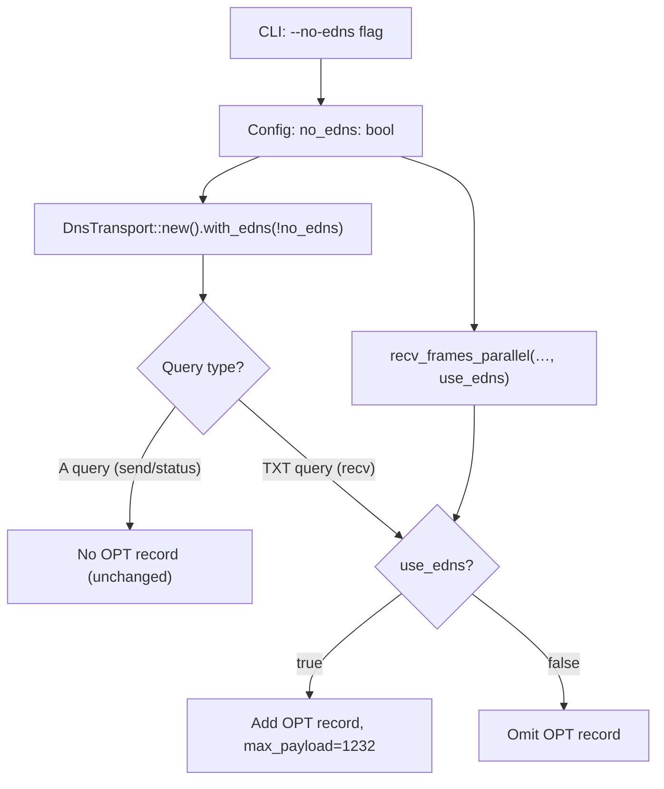

# Design Document: Optional EDNS0

## Overview

This feature adds a `--no-edns` CLI flag to both the `socks-client` and `exit-node` binaries that suppresses the EDNS0 OPT record on outgoing TXT queries. When tunneling through recursive resolvers (e.g. Cloudflare 1.1.1.1), the EDNS0-advertised larger UDP buffer causes the broker to batch multiple TXT records into a single response. Some resolvers truncate or drop these larger responses, causing data loss and session stalls. Disabling EDNS0 forces the broker to return at most 1 message per response (≤512 bytes), which all resolvers handle correctly. The tradeoff is reduced throughput (1 frame per round trip) for improved reliability.

This is a client-side-only change. The broker already handles both EDNS0 and non-EDNS0 queries per-request based on whether the client sent the OPT record. No broker changes are needed.

## Architecture

The change threads a single boolean (`use_edns`) from CLI parsing through config structs into the DNS transport layer. The flow is:

```
CLI flag (--no-edns)
  → Config struct (no_edns: bool)
    → DnsTransport (use_edns: bool field, set via with_edns() builder)
      → build_dns_query() conditionally adds OPT record
      → recv_frames_parallel() accepts use_edns parameter
```



Only `DnsTransport` is affected. `DirectTransport` (embedded mode) bypasses DNS entirely and is unaffected.

## Components and Interfaces

### 1. CLI and Config (`config.rs`)

**SocksClientCli** — add field:
```rust
/// Disable EDNS0 OPT record on TXT queries (reduces response size for
/// compatibility with recursive resolvers that truncate large UDP responses).
#[arg(long)]
pub no_edns: bool,
```

**SocksClientConfig** — add field:
```rust
/// Whether to disable EDNS0 on TXT queries.
pub no_edns: bool,
```

Wire in `SocksClientCli::into_config()`:
```rust
no_edns: self.no_edns,
```

**ExitNodeCli** — add identical `--no-edns` field.

**ExitNodeConfig** — add identical `no_edns: bool` field.

Wire in `ExitNodeCli::into_config()`:
```rust
no_edns: self.no_edns,
```

### 2. DnsTransport (`transport.rs`)

Add a `use_edns: bool` field (default `true`) and a builder method:

```rust
pub struct DnsTransport {
    // ... existing fields ...
    use_edns: bool,
}

impl DnsTransport {
    pub fn with_edns(mut self, use_edns: bool) -> Self {
        self.use_edns = use_edns;
        self
    }
}
```

Modify `build_dns_query` to accept a `use_edns` parameter:

```rust
fn build_dns_query(name: &Name, record_type: RecordType, use_edns: bool) -> Result<Vec<u8>, TransportError> {
    // ... existing setup ...
    if record_type == RecordType::TXT && use_edns {
        let mut edns = Edns::new();
        edns.set_max_payload(EDNS_UDP_SIZE);
        edns.set_version(0);
        message.set_edns(edns);
    }
    // ...
}
```

Update all call sites of `build_dns_query` within `DnsTransport` to pass `self.use_edns`.

### 3. Parallel Recv (`transport.rs`)

Add `use_edns: bool` parameter to `recv_frames_parallel` and `recv_single_parallel_query`:

```rust
pub async fn recv_frames_parallel(
    resolver_addr: SocketAddr,
    controlled_domain: &str,
    channel: &str,
    count: usize,
    query_timeout: Duration,
    use_edns: bool,  // new parameter
) -> Vec<Vec<u8>> { ... }
```

Pass `use_edns` through to `DnsTransport::build_dns_query` in the parallel query path.

### 4. Binary Wiring

**socks_client.rs** — when constructing `DnsTransport` instances:
```rust
// Per-session transport
let transport = Arc::new(
    DnsTransport::new(config.resolver_addr, config.controlled_domain.clone())
        .await?
        .with_query_interval(config.query_interval)
        .with_edns(!config.no_edns),
);

// Control channel poller transport
let poller_transport = Arc::new(
    DnsTransport::new(shared_config.resolver_addr, shared_config.controlled_domain.clone())
        .await?
        .with_query_interval(shared_config.query_interval)
        .with_edns(!shared_config.no_edns),
);
```

**exit_node.rs** — when constructing `DnsTransport` in standalone mode:
```rust
Arc::new(
    DnsTransport::new(resolver, config.controlled_domain.clone())
        .await?
        .with_edns(!config.no_edns),
)
```

Update `recv_frames_parallel` call sites in exit_node.rs to pass the `use_edns` value derived from config.

## Data Models

No new data models. The change adds a single `bool` field to four existing structs:

| Struct | Field | Default | Source |
|--------|-------|---------|--------|
| `SocksClientCli` | `no_edns: bool` | `false` | CLI `--no-edns` flag |
| `SocksClientConfig` | `no_edns: bool` | `false` | Copied from CLI |
| `ExitNodeCli` | `no_edns: bool` | `false` | CLI `--no-edns` flag |
| `ExitNodeConfig` | `no_edns: bool` | `false` | Copied from CLI |
| `DnsTransport` | `use_edns: bool` | `true` | Set via `with_edns()` builder |

The inversion (`no_edns` in config → `use_edns` in transport) keeps the CLI flag positive-sense (`--no-edns` disables) while the transport field is positive-sense (`use_edns = true` means include OPT).


## Correctness Properties

*A property is a characteristic or behavior that should hold true across all valid executions of a system — essentially, a formal statement about what the system should do. Properties serve as the bridge between human-readable specifications and machine-verifiable correctness guarantees.*

### Property 1: EDNS0 OPT record presence is determined by record type and use_edns flag

*For any* valid DNS name, *for any* record type in {A, TXT}, and *for any* boolean value of `use_edns`, the DNS query built by `build_dns_query(name, record_type, use_edns)` contains an EDNS0 OPT record if and only if `record_type == TXT && use_edns == true`. When the OPT record is present, its `max_payload` must equal 1232.

**Validates: Requirements 3.2, 3.3, 4.1, 4.2**

## Error Handling

No new error paths are introduced. The change is purely additive (a boolean flag) and affects only whether an optional DNS extension record is included in outgoing queries. All existing error handling for DNS query construction, timeouts, and transport failures remains unchanged.

- If `--no-edns` is provided, the broker returns at most 1 TXT record per response. The existing `parse_txt_responses` and envelope decoding logic already handles single-record responses correctly.
- If `--no-edns` is not provided, behavior is identical to today.

## Testing Strategy

### Unit Tests

Unit tests cover the example-based and edge-case acceptance criteria:

1. **CLI default**: `SocksClientCli` without `--no-edns` produces `SocksClientConfig { no_edns: false }`.
2. **CLI flag set**: `SocksClientCli` with `--no-edns` produces `SocksClientConfig { no_edns: true }`.
3. **Exit node CLI default**: `ExitNodeCli` without `--no-edns` produces `ExitNodeConfig { no_edns: false }`.
4. **Exit node CLI flag set**: `ExitNodeCli` with `--no-edns` produces `ExitNodeConfig { no_edns: true }`.
5. **DnsTransport default**: A newly constructed `DnsTransport` has `use_edns = true`.
6. **DnsTransport builder**: `DnsTransport::new(...).with_edns(false)` sets `use_edns = false`.

### Property-Based Tests

Property-based tests use the `proptest` crate (already a dependency in this project) with a minimum of 100 iterations per property.

1. **Property 1 test**: Generate random valid DNS name components (alphanumeric labels), random record type (A or TXT), and random `use_edns` boolean. Call `build_dns_query`, parse the resulting bytes back into a `Message`, and assert:
   - OPT record is present ⟺ `record_type == TXT && use_edns == true`
   - When present, `max_payload == 1232`

   Tag: **Feature: optional-edns, Property 1: EDNS0 OPT record presence is determined by record type and use_edns flag**

Each correctness property is implemented by a single property-based test. The `proptest` library handles input generation and shrinking. Tests should be placed in `crates/dns-socks-proxy/tests/` or inline in `transport.rs` tests module.
