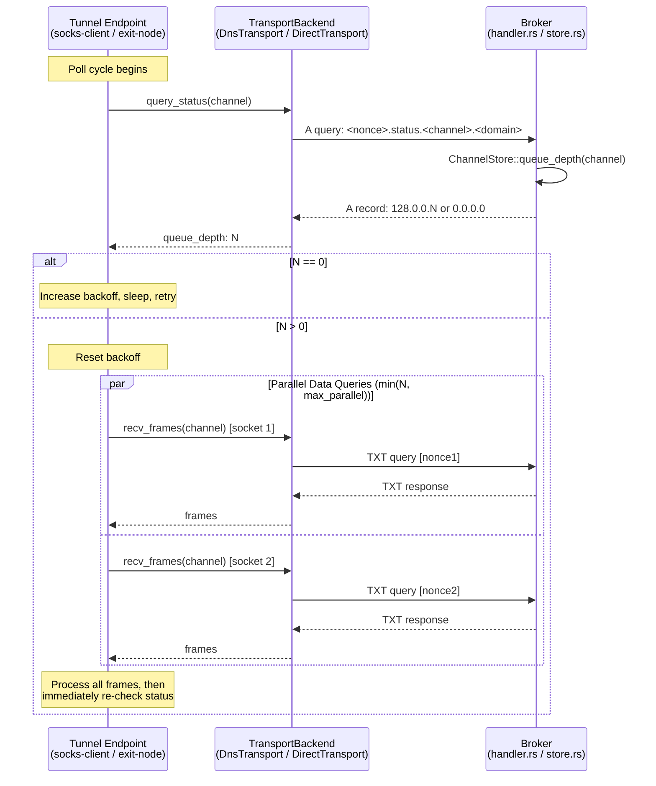
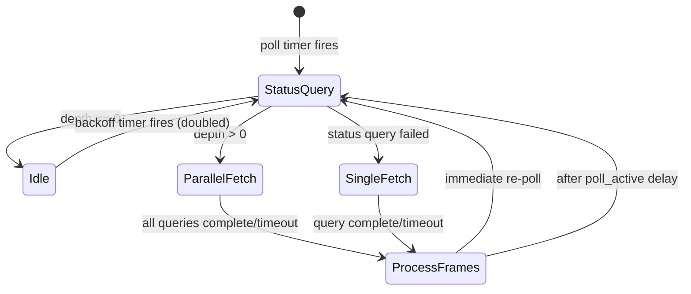

# Design Document: Parallel Status Polling

## Overview

This feature introduces a two-phase poll cycle for the DNS tunnel's downstream (socks-client) and upstream (exit-node) data retrieval paths. Today, each poll cycle issues a single TXT query, waits for the response, and repeats — throughput is capped at one batch per DNS round-trip. The new design adds a lightweight **status query** (DNS A record) that returns the number of messages queued on the Broker, followed by **N parallel TXT data queries** fired concurrently — one per queued message. An adaptive exponential backoff governs the interval between poll cycles, minimizing idle DNS traffic while maximizing throughput under load.

### Key Design Decisions

1. **Status query as A record, not TXT** — A records are smaller and faster to process. The queue depth is encoded in the IP address itself (high octet `128` + 24-bit depth), keeping the response a single fixed-size record.
2. **One ephemeral UDP socket per parallel query** — Reusing the session's main socket would cause response cross-contamination between concurrent TXT queries. Ephemeral sockets are cheap and closed immediately after use.
3. **Encoding scheme uses octet 128 as sentinel** — Existing broker IPs use `1.2.3.x` for ACK/error signals. The `128.x.x.x` range is unambiguous and leaves 24 bits (16M+ values) for queue depth.
4. **Backoff resets on any data, not just on status > 0** — This keeps the system responsive when messages arrive in bursts.
5. **Cap parallel queries with `max_parallel_queries`** — Prevents resource exhaustion from binding too many sockets when the queue is very deep.

## Architecture

The feature touches three layers:



### Crate Boundaries

| Change Area | Crate | Files |
|---|---|---|
| Status IP encoding/decoding | `dns-socks-proxy` | `transport.rs` (new `status` submodule or inline) |
| `queue_depth` method | `dns-message-broker` | `store.rs` |
| Status query routing + handler | `dns-message-broker` | `handler.rs` |
| `TransportBackend::query_status` | `dns-socks-proxy` | `transport.rs` |
| Parallel poll loop | `dns-socks-proxy` | `socks_client.rs`, `exit_node.rs` |
| Config additions | `dns-socks-proxy` | `config.rs` |

## Components and Interfaces

### 1. Status IP Encoding (`dns-socks-proxy::transport` or new `status` module)

```rust
/// Encode a queue depth into a status IP address.
/// First octet = 128, remaining 24 bits = depth (clamped to 0x00FF_FFFF).
pub fn encode_status_ip(depth: usize) -> Ipv4Addr;

/// Decode a status IP response into a queue depth.
/// Returns Ok(0) for 0.0.0.0, Ok(depth) for 128.x.x.x,
/// Err for any other IP.
pub fn decode_status_ip(ip: Ipv4Addr) -> Result<usize, TransportError>;
```

### 2. ChannelStore::queue_depth (`dns-message-broker::store`)

```rust
impl<C: Clock> ChannelStore<C> {
    /// Return the number of pending messages in the channel.
    /// Returns 0 if the channel does not exist.
    /// This is a read-only operation — no messages are popped.
    pub fn queue_depth(&self, channel: &str) -> usize;
}
```

This method takes `&self` (not `&mut self`), satisfying the read-only requirement. In the server, the `SharedStore` is `Arc<RwLock<ChannelStore>>`, so the status handler only needs a read lock.

### 3. Broker Status Handler (`dns-message-broker::handler`)

The existing `handle_query` router gains a new branch. When an A query's labels contain `status` immediately before the channel label, it routes to `handle_status` instead of `handle_send`.

```rust
/// Detect whether the query is a status query.
/// Format: <nonce>.status.<channel>.<controlled_domain>
fn is_status_query(remaining_labels: &[&str]) -> bool;

/// Handle a status query: look up queue depth, encode as A record.
fn handle_status<C: Clock>(
    query: &DnsMessage,
    config: &Config,
    store: &ChannelStore<C>,  // &self — read-only
) -> Vec<u8>;
```

Note: `handle_status` takes `&ChannelStore` (immutable reference), not `&mut ChannelStore`. The server's `process_packet` function will need to be updated: for status queries, acquire a **read lock** instead of a write lock. For send/receive queries, continue using a write lock.

### 4. TransportBackend trait extension (`dns-socks-proxy::transport`)

```rust
#[async_trait]
pub trait TransportBackend: Send + Sync {
    // ... existing methods ...

    /// Query the queue depth for a channel.
    async fn query_status(&self, channel: &str) -> Result<usize, TransportError>;
}
```

**DnsTransport implementation**: Builds the DNS name `<nonce>.status.<channel>.<domain>`, sends an A query, parses the A record response, and calls `decode_status_ip`.

**DirectTransport implementation**: Calls `store.read().await.queue_depth(channel)` directly.

### 5. Parallel Data Retrieval (`dns-socks-proxy::transport`)

A new free function (or method on `DnsTransport`) handles firing N parallel TXT queries:

```rust
/// Fire `count` parallel TXT recv queries on separate ephemeral UDP sockets.
/// Returns all successfully received frame batches, flattened.
/// Each query uses a unique nonce. Failed/timed-out queries are logged and skipped.
pub async fn recv_frames_parallel(
    resolver_addr: SocketAddr,
    controlled_domain: &str,
    channel: &str,
    count: usize,
    query_timeout: Duration,
) -> Vec<Vec<u8>>;
```

For `DirectTransport`, parallel retrieval is unnecessary — `pop_many` already drains multiple messages atomically. The `recv_frames_parallel` concept only applies to `DnsTransport`.

### 6. Adaptive Backoff State

A small struct encapsulates the backoff logic, used by both `downstream_task` (socks-client) and `upstream_task` (exit-node):

```rust
pub struct AdaptiveBackoff {
    current: Duration,
    min: Duration,      // poll_active
    max: Duration,      // poll_idle or backoff_max
}

impl AdaptiveBackoff {
    pub fn new(min: Duration, max: Duration) -> Self;
    /// Double the interval (clamped to max).
    pub fn increase(&mut self);
    /// Reset to min.
    pub fn reset(&mut self);
    /// Return the current interval.
    pub fn current(&self) -> Duration;
}
```

### 7. Configuration Additions (`dns-socks-proxy::config`)

Both `SocksClientCli` and `ExitNodeCli` gain:

```rust
/// Maximum number of parallel TXT data queries per poll cycle (default: 8).
#[arg(long, default_value_t = 8)]
pub max_parallel_queries: usize,

/// Maximum backoff interval in milliseconds (default: value of poll_idle_ms).
#[arg(long)]
pub backoff_max_ms: Option<u64>,
```

The validated config structs gain corresponding fields:

```rust
pub max_parallel_queries: usize,
pub backoff_max: Duration,  // defaults to poll_idle if not specified
```

## Data Models

### Status IP Encoding Format

```
Octet layout of status response A record:

  ┌──────────┬──────────┬──────────┬──────────┐
  │  Octet 0 │  Octet 1 │  Octet 2 │  Octet 3 │
  │   0x80   │  depth   │  depth   │  depth   │
  │ (128)    │  [23:16] │  [15:8]  │  [7:0]   │
  └──────────┴──────────┴──────────┴──────────┘

Special case: 0.0.0.0 → queue depth = 0 (no data)
Sentinel:     128.x.x.x → queue depth = (x << 16) | (x << 8) | x
Existing:     1.2.3.4 → ACK (unchanged)
              1.2.3.5 → payload too large (unchanged)
              1.2.3.6 → channel full (unchanged)
```

### Status Query DNS Name Format

```
<nonce>.status.<channel>.<controlled_domain>

Example: a7k2.status.d-aBcD1234.tunnel.example.com
```

- `nonce`: 4-char random alphanumeric (prevents resolver caching)
- `status`: fixed label identifying this as a status query
- `channel`: the channel name to inspect
- `controlled_domain`: the broker's controlled domain

### Updated Poll Cycle State Machine



### Configuration Defaults

| Parameter | CLI Flag | Default | Description |
|---|---|---|---|
| `max_parallel_queries` | `--max-parallel-queries` | 8 | Max concurrent TXT queries per cycle |
| `backoff_max` | `--backoff-max-ms` | `poll_idle_ms` | Upper bound on exponential backoff |

## Correctness Properties

*A property is a characteristic or behavior that should hold true across all valid executions of a system — essentially, a formal statement about what the system should do. Properties serve as the bridge between human-readable specifications and machine-verifiable correctness guarantees.*

### Property 1: Status IP encoding round-trip

*For all* queue depth values in the range 0 to 16,777,215, encoding the depth into a status IP address and then decoding that IP address back shall produce the original queue depth value.

**Validates: Requirements 2.1, 2.2, 2.3**

### Property 2: Non-status IPs are rejected by the decoder

*For all* `Ipv4Addr` values where the first octet is not `128` and the address is not `0.0.0.0`, calling `decode_status_ip` shall return an error.

**Validates: Requirements 2.6**

### Property 3: Status query routing — status label routes to status handler

*For all* valid channel names and nonces, an A query with the name format `<nonce>.status.<channel>.<controlled_domain>` shall be routed to the status handler (not the send handler).

**Validates: Requirements 1.1, 6.1**

### Property 4: Non-status A queries still route to send handler

*For all* valid A queries whose labels do not contain `status` in the position immediately before the channel label, the query shall continue to be routed to the existing send handler.

**Validates: Requirements 6.2**

### Property 5: Status query returns correct queue depth

*For all* channels with N messages pushed (N > 0), a status query for that channel shall return an A record encoding queue depth N.

**Validates: Requirements 1.2, 7.1**

### Property 6: Status queries are read-only

*For all* channels with N messages, issuing a status query shall not change the number of messages in the channel — `queue_depth` before and after the status query shall be equal.

**Validates: Requirements 1.5**

### Property 7: Status response TTL is always zero

*For all* status query responses (whether the channel has data or not), the TTL of the A record in the response shall be 0.

**Validates: Requirements 1.6**

### Property 8: Status query name format

*For all* channel names and controlled domains, the constructed status query DNS name shall match the format `<4-char-alphanumeric-nonce>.status.<channel>.<controlled_domain>`.

**Validates: Requirements 3.1**

### Property 9: Parallel query count equals min(depth, max_parallel)

*For all* queue depths N > 0 and configured max_parallel M, the number of concurrent data queries fired shall equal min(N, M).

**Validates: Requirements 3.4, 4.1, 4.7, 10.3**

### Property 10: Parallel queries use unique nonces

*For all* sets of N parallel data queries (N ≥ 2), every query shall have a distinct nonce in its DNS name.

**Validates: Requirements 4.2**

### Property 11: Partial parallel query failure preserves successful results

*For all* sets of N parallel data queries where K queries succeed and (N-K) fail, the returned frame set shall contain exactly the frames from the K successful queries.

**Validates: Requirements 4.6**

### Property 12: Exponential backoff doubles on idle and clamps to max

*For all* sequences of K consecutive idle poll cycles (depth == 0), the backoff interval after K idle cycles shall equal min(poll_active × 2^K, backoff_max).

**Validates: Requirements 5.1, 5.2, 5.5**

### Property 13: Backoff resets to poll_active on data detection

*For all* backoff states (regardless of current interval), when a status response indicates queue depth > 0, the backoff interval shall reset to poll_active.

**Validates: Requirements 5.3**

### Property 14: DirectTransport query_status matches store queue_depth

*For all* channels, `DirectTransport::query_status(channel)` shall return the same value as `store.queue_depth(channel)`.

**Validates: Requirements 8.3**

## Error Handling

### Status Query Errors

| Error Condition | Handling |
|---|---|
| Status query DNS timeout | Treat depth as unknown; fall back to single data query |
| Status query returns unrecognized IP | Log warning; treat depth as unknown; fall back to single data query |
| Status query for non-existent channel | Broker returns `0.0.0.0`; client skips data retrieval |
| Status query for name outside controlled domain | Broker returns REFUSED; client treats as error → fallback |

### Parallel Data Query Errors

| Error Condition | Handling |
|---|---|
| Ephemeral UDP socket bind failure | Skip that query slot; log error; continue with remaining |
| Individual TXT query timeout | Log timeout; continue processing results from other queries |
| Individual TXT query parse error | Log error; skip that response; continue with remaining |
| All parallel queries fail | No frames delivered; next poll cycle will re-check status |

### Backoff Edge Cases

| Condition | Behavior |
|---|---|
| backoff_max < poll_active | Clamp backoff_max to poll_active (invalid config) |
| max_parallel_queries = 0 | Treat as 1 (minimum) |
| Queue depth exceeds 24-bit max | Broker clamps to 16,777,215; client fires min(16M, max_parallel) queries |

## Testing Strategy

### Unit Tests

Unit tests cover specific examples, edge cases, and error conditions:

- `encode_status_ip(0)` → `128.0.0.0`
- `encode_status_ip(1)` → `128.0.0.1`
- `encode_status_ip(16_777_215)` → `128.255.255.255`
- `encode_status_ip(16_777_216)` → `128.255.255.255` (clamped)
- `decode_status_ip(Ipv4Addr::new(0,0,0,0))` → `Ok(0)`
- `decode_status_ip(Ipv4Addr::new(1,2,3,4))` → `Err(...)` (ACK IP)
- Status query for empty channel returns `0.0.0.0`
- Status query for non-existent channel returns `0.0.0.0`
- Status query outside controlled domain returns REFUSED
- `queue_depth` on non-existent channel returns 0
- `AdaptiveBackoff::new(50ms, 500ms)` starts at 50ms
- Backoff after 1 idle → 100ms, after 2 → 200ms, after 3 → 400ms, after 4 → 500ms (clamped)
- Config defaults: `max_parallel_queries` = 8, `backoff_max` = `poll_idle`
- Config with `max_parallel_queries = 1` produces sequential behavior

### Property-Based Tests

Property-based tests use the `proptest` crate (already a dev-dependency in both crates). Each test runs a minimum of 100 iterations and is tagged with its design property reference.

- **Feature: parallel-status-polling, Property 1: Status IP encoding round-trip** — Generate random `u32` values in `0..=16_777_215`, encode, decode, assert equality.
- **Feature: parallel-status-polling, Property 2: Non-status IPs are rejected** — Generate random `Ipv4Addr` where octet 0 ≠ 128 and addr ≠ 0.0.0.0, assert `decode_status_ip` returns `Err`.
- **Feature: parallel-status-polling, Property 3: Status query routing** — Generate random channel names (alphanumeric, 1-20 chars) and nonces, construct status query, verify routing.
- **Feature: parallel-status-polling, Property 4: Non-status A queries route to send** — Generate random valid send query names (without "status" label), verify send handler is invoked.
- **Feature: parallel-status-polling, Property 5: Status query returns correct depth** — Generate random N in 1..50, push N messages, issue status query, verify encoded depth == N.
- **Feature: parallel-status-polling, Property 6: Status queries are read-only** — Generate random N, push N messages, issue status query, verify queue_depth unchanged.
- **Feature: parallel-status-polling, Property 7: Status response TTL is zero** — Generate random channels (empty and non-empty), issue status query, verify TTL == 0 in response.
- **Feature: parallel-status-polling, Property 8: Status query name format** — Generate random channel names and domains, verify constructed name matches regex `^[a-z0-9]{4}\.status\..+\..+$`.
- **Feature: parallel-status-polling, Property 9: Parallel query count** — Generate random (depth, max_parallel) pairs, verify computed count == min(depth, max_parallel).
- **Feature: parallel-status-polling, Property 10: Unique nonces** — Generate random N in 2..20, generate N nonces, verify all distinct.
- **Feature: parallel-status-polling, Property 11: Partial failure preserves results** — Generate random success/failure masks for N queries, verify output contains exactly the successful frames.
- **Feature: parallel-status-polling, Property 12: Exponential backoff** — Generate random K in 0..20, min and max durations, verify interval == min(min × 2^K, max).
- **Feature: parallel-status-polling, Property 13: Backoff reset** — Generate random backoff states, call reset, verify interval == min.
- **Feature: parallel-status-polling, Property 14: DirectTransport query_status** — Generate random channel states, verify DirectTransport.query_status == store.queue_depth.

