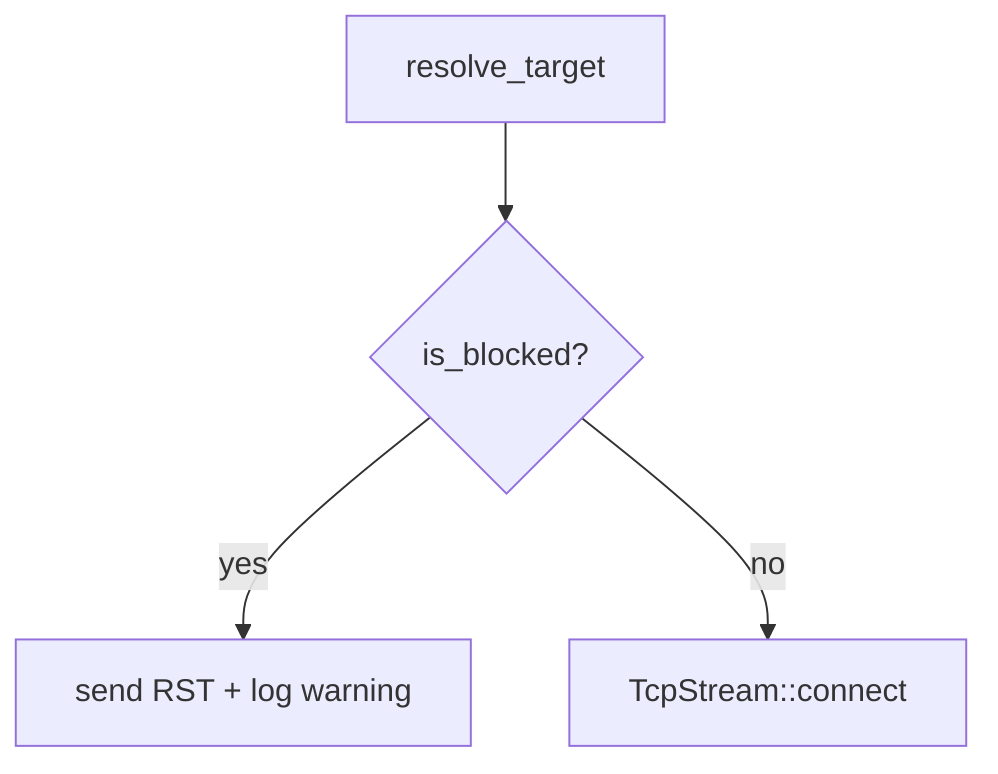

# Design Document: Private Network Guard

## Overview

This feature adds a CIDR-based address guard to the exit node that blocks outbound TCP connections to private, loopback, link-local, and other sensitive network ranges. The guard is a pure function `is_blocked(addr, cidrs) -> bool` inserted between `resolve_target` and `TcpStream::connect` in `handle_syn`. When an address is blocked, the exit node sends RST to the client and skips the TCP connect entirely.

Default blocked ranges (RFC 1918, loopback, link-local, unique local, unspecified, cloud IMDS) are active out of the box. Two CLI flags control behaviour: `--allow-private-networks` disables the defaults, and `--disallow-network <CIDR>` (repeatable) adds custom blocked ranges. The flags compose: with both present, only custom ranges are enforced.

The implementation adds a new `guard` module to `dns-socks-proxy`, extends `ExitNodeCli`/`ExitNodeConfig` with the two flags, and inserts a ~5-line guard check in `handle_syn`. The `ipnet` crate provides CIDR parsing and containment checks.

## Architecture

The guard sits in the `handle_syn` flow between DNS resolution and TCP connect:



The blocked CIDR list is computed once at startup from CLI flags and passed as `Arc<Vec<IpNet>>` into `handle_syn`. The `is_blocked` function is pure — no I/O, no state — making it trivially testable.

### Key decisions

1. **Pure function in a separate module (`guard.rs`)**: Keeps the classification logic isolated from async/networking code. The function takes `(IpAddr, &[IpNet])` and returns `bool`. This enables property-based testing without mocking.

2. **`ipnet` crate for CIDR handling**: `ipnet::IpNet` provides `contains()` for both IPv4 and IPv6 networks. It also implements `FromStr` for parsing CLI input. This avoids hand-rolling CIDR math.

3. **Default list as a constant function**: A `fn default_blocked_ranges() -> Vec<IpNet>` returns the hardcoded defaults. This is called at startup and can be skipped when `--allow-private-networks` is set.

4. **Guard check placement**: After `resolve_target` returns a `SocketAddr`, we extract the `IpAddr` and call `is_blocked`. If blocked, we send RST (reusing the existing `send_rst` helper) and return early — identical to the existing TCP-connect-failure path.

## Components and Interfaces

### New module: `guard.rs` (crates/dns-socks-proxy/src/guard.rs)

```rust
use std::net::IpAddr;
use ipnet::IpNet;

/// Returns the default set of blocked CIDR ranges.
pub fn default_blocked_ranges() -> Vec<IpNet> {
    [
        "10.0.0.0/8", "172.16.0.0/12", "192.168.0.0/16",   // RFC 1918
        "127.0.0.0/8", "::1/128",                            // Loopback
        "169.254.0.0/16", "fe80::/10",                       // Link-local
        "fc00::/7",                                           // Unique local
        "0.0.0.0/8", "::/128",                               // Unspecified
        "fd00:ec2::254/128",                                  // EC2 IMDS IPv6
    ]
    .iter()
    .map(|s| s.parse().expect("hardcoded CIDR is valid"))
    .collect()
}

/// Returns true if `addr` falls within any of the provided CIDR ranges.
pub fn is_blocked(addr: IpAddr, blocked: &[IpNet]) -> bool {
    blocked.iter().any(|net| net.contains(&addr))
}
```

### Modified: `ExitNodeCli` (config.rs)

Two new CLI fields:

```rust
/// Disable default private-network blocking (allows RFC 1918, loopback, etc.).
#[arg(long)]
pub allow_private_networks: bool,

/// Additional CIDR ranges to block (repeatable).
#[arg(long = "disallow-network", value_name = "CIDR")]
pub disallow_networks: Vec<String>,
```

### Modified: `ExitNodeConfig` (config.rs)

One new field holding the pre-computed blocked list:

```rust
/// Active blocked CIDR ranges (computed from defaults + CLI flags).
pub blocked_networks: Vec<IpNet>,
```

### Modified: `ExitNodeCli::into_config` (config.rs)

Computes the blocked list:

```rust
let mut blocked = if self.allow_private_networks {
    info!("default private-network blocking disabled by --allow-private-networks");
    vec![]
} else {
    default_blocked_ranges()
};
for cidr_str in &self.disallow_networks {
    let net: IpNet = cidr_str.parse().map_err(|e| ConfigError::InvalidCidr {
        value: cidr_str.clone(),
        source: e,
    })?;
    blocked.push(net);
}
```

### Modified: `handle_syn` (exit_node.rs)

Insert between `resolve_target` and `TcpStream::connect`:

```rust
let target_socket_addr = resolve_target(&target_addr, target_port).await?;

// --- Private network guard ---
if is_blocked(target_socket_addr.ip(), &config.blocked_networks) {
    warn!(session_id = %session_id, addr = %target_socket_addr, "blocked by private network guard");
    send_rst(&transport, &client_control_channel, &config.node_id, &session_id, &config.psk).await;
    return Ok(());
}

let tcp_stream = match tokio::time::timeout( ... )
```

## Data Models

### `IpNet` (from `ipnet` crate)

The `ipnet::IpNet` enum covers both `Ipv4Net` and `Ipv6Net`. It provides:
- `FromStr` for parsing CIDR strings like `"10.0.0.0/8"`
- `contains(&IpAddr) -> bool` for membership testing

No custom data structures are needed. The blocked list is `Vec<IpNet>`, wrapped in `Arc<Vec<IpNet>>` when shared across spawned tasks.

### New `ConfigError` variant

```rust
#[error("invalid CIDR in --disallow-network: {value}: {source}")]
InvalidCidr { value: String, source: ipnet::AddrParseError },
```

### New dependency

Add to `crates/dns-socks-proxy/Cargo.toml`:

```toml
ipnet = "2"
```


## Correctness Properties

*A property is a characteristic or behavior that should hold true across all valid executions of a system — essentially, a formal statement about what the system should do. Properties serve as the bridge between human-readable specifications and machine-verifiable correctness guarantees.*

### Property 1: Addresses inside any CIDR are blocked

*For any* list of valid CIDR ranges and *for any* IP address that falls within at least one of those ranges, `is_blocked(addr, cidrs)` shall return `true`.

**Validates: Requirements 1.2**

### Property 2: Addresses outside all CIDRs are allowed

*For any* list of valid CIDR ranges and *for any* IP address that does not fall within any of those ranges, `is_blocked(addr, cidrs)` shall return `false`.

**Validates: Requirements 1.3**

### Property 3: Blocked list computation from flags

*For any* boolean value of `allow_private_networks` and *for any* list of valid CIDR strings passed as `disallow_networks`, the computed `blocked_networks` list shall equal the default ranges (when `allow_private_networks` is false) plus the custom ranges, or only the custom ranges (when `allow_private_networks` is true).

**Validates: Requirements 4.1, 4.3**

### Property 4: Invalid CIDR strings produce parse errors

*For any* string that is not valid CIDR notation, passing it as a `disallow_network` value shall produce a configuration error.

**Validates: Requirements 4.4**

## Error Handling

| Condition | Behaviour |
|---|---|
| `is_blocked` returns `true` | Send RST to client, log warning with session ID and blocked address, return early from `handle_syn` |
| Invalid CIDR in `--disallow-network` | `into_config` returns `ConfigError::InvalidCidr`, exit node exits at startup with error message |
| `--allow-private-networks` set | Log info at startup, proceed with empty default list |

No new runtime panics or error variants beyond `ConfigError::InvalidCidr`. The guard itself is infallible — `IpNet::contains` cannot fail.

## Testing Strategy

### Property-based tests

Use the `proptest` crate (already a dev-dependency). Each property test runs a minimum of 100 iterations.

- **Property 1 & 2**: Generate random `IpNet` ranges and random `IpAddr` values. For P1, generate addresses known to be inside a range (by constructing them from the network address + offset within the range). For P2, generate addresses and filter/reject those inside any range.
- **Property 3**: Generate random `bool` for `allow_private_networks` and random valid CIDR strings for `disallow_networks`. Compute the blocked list and assert it matches the expected composition.
- **Property 4**: Generate random strings that are not valid CIDR (e.g., missing prefix length, invalid octets). Assert that parsing fails.

Each property test must be tagged with a comment:
```
// Feature: private-network-guard, Property N: <property text>
```

Each correctness property must be implemented by a single property-based test.

### Unit tests

- `is_blocked` with each default range (one address per range) — verifies the default list is correct.
- `is_blocked` with a public address (e.g., `8.8.8.8`) against defaults — returns false.
- `default_blocked_ranges()` returns the expected number of entries (12 ranges).
- Config: `--allow-private-networks` produces empty default list.
- Config: `--disallow-network 203.0.113.0/24` adds the range.
- Config: invalid CIDR `"not-a-cidr"` produces `ConfigError::InvalidCidr`.

### Test file

Property tests go in `crates/dns-socks-proxy/tests/private_network_guard_props.rs`. Unit tests go in `guard.rs` and `config.rs` inline `#[cfg(test)]` modules.
