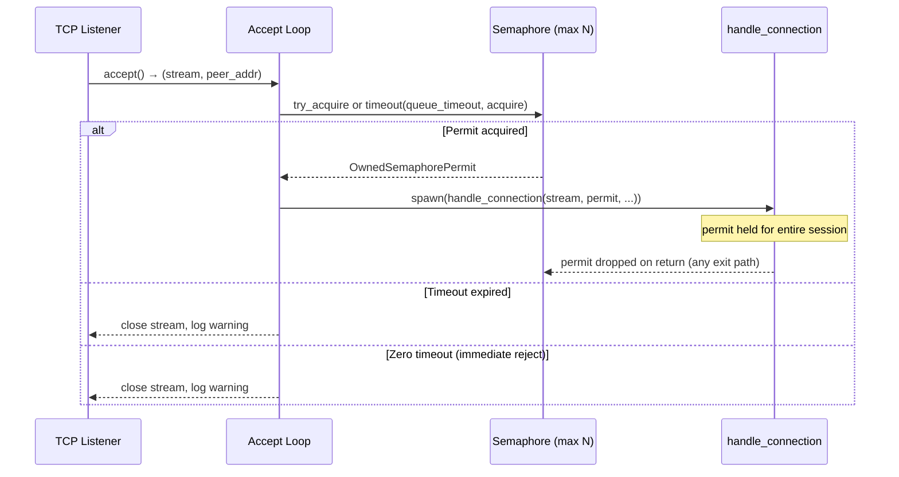

# Design Document: Session Concurrency Limiter

## Overview

This feature adds a concurrency limiter to the `socks_client` binary that caps the number of simultaneously active SOCKS5 sessions. The limiter uses a `tokio::sync::Semaphore` to gate admission into `handle_connection`, queuing excess connections with a configurable timeout. Two new CLI flags (`--max-concurrent-sessions` and `--queue-timeout-ms`) control the behaviour.

The design is intentionally minimal: a single `Arc<Semaphore>` shared between the accept loop and spawned tasks, with permit lifetime managed via an RAII guard (mirroring the existing `DispatcherGuard` pattern). No new modules or files are required — all changes land in `socks_client.rs` and `config.rs`.

## Architecture

The concurrency limiter sits between the TCP accept loop and the `handle_connection` call. The flow becomes:



Key architectural decisions:

1. **Semaphore in the accept loop, not inside `handle_connection`**: Acquiring the permit before spawning the task means the spawned task count itself is bounded. This prevents resource waste from spawning tasks that immediately block.

2. **`OwnedSemaphorePermit` moved into the spawned task**: The permit is acquired in the accept loop and moved into the closure. When `handle_connection` returns (or the task panics), the permit is dropped automatically. No explicit RAII wrapper struct is needed — the `OwnedSemaphorePermit` itself is the RAII guard.

3. **Zero timeout = immediate rejection**: When `--queue-timeout-ms 0`, the accept loop uses `Semaphore::try_acquire_owned()` instead of a timed wait, providing instant backpressure.

## Components and Interfaces

### Modified: `SocksClientCli` (config.rs)

Two new CLI fields:

```rust
/// Maximum number of concurrent active sessions (default: 8).
#[arg(long, default_value_t = 8)]
pub max_concurrent_sessions: usize,

/// Queue timeout in milliseconds for waiting connections (default: 30000).
/// Set to 0 to reject immediately when all permits are in use.
#[arg(long, default_value_t = 30000)]
pub queue_timeout_ms: u64,
```

### Modified: `SocksClientConfig` (config.rs)

Two new validated fields:

```rust
/// Maximum number of concurrent active sessions.
pub max_concurrent_sessions: usize,
/// Queue timeout for waiting connections.
pub queue_timeout: Duration,
```

### Modified: `SocksClientCli::into_config` (config.rs)

Validation added: `max_concurrent_sessions < 1` produces `ConfigError::InvalidMaxConcurrentSessions`.

### New variant: `ConfigError::InvalidMaxConcurrentSessions` (config.rs)

```rust
#[error("--max-concurrent-sessions must be >= 1, got {got}")]
InvalidMaxConcurrentSessions { got: usize },
```

### Modified: `main()` accept loop (socks_client.rs)

The accept loop changes from:

```rust
loop {
    let (stream, peer_addr) = listener.accept().await?;
    tokio::spawn(async move { handle_connection(stream, ...).await; });
}
```

To:

```rust
let semaphore = Arc::new(Semaphore::new(config.max_concurrent_sessions));

loop {
    let (stream, peer_addr) = listener.accept().await?;
    let permit = acquire_permit(&semaphore, config.queue_timeout, peer_addr).await;
    match permit {
        Some(permit) => {
            tokio::spawn(async move {
                let _permit = permit; // held until task ends
                handle_connection(stream, ...).await;
            });
        }
        None => {
            // Connection timed out or rejected; stream dropped (closed).
        }
    }
}
```

### New helper: `acquire_permit()` (socks_client.rs)

```rust
async fn acquire_permit(
    semaphore: &Arc<Semaphore>,
    queue_timeout: Duration,
    peer_addr: std::net::SocketAddr,
) -> Option<OwnedSemaphorePermit>
```

Handles the three cases:
- Permit available immediately → acquire and log dequeue with 0ms wait.
- Permit not available, timeout > 0 → wait with timeout, log queued/dequeued/timed-out.
- Timeout == 0 → `try_acquire_owned()`, log rejection on failure.

## Data Models

No new data structures are introduced. The feature reuses:

- `tokio::sync::Semaphore` — counting semaphore for permit management.
- `tokio::sync::OwnedSemaphorePermit` — RAII permit that releases on drop.
- `SocksClientConfig` — extended with two new fields (`max_concurrent_sessions: usize`, `queue_timeout: Duration`).
- `ConfigError` — extended with one new variant (`InvalidMaxConcurrentSessions`).


## Correctness Properties

*A property is a characteristic or behavior that should hold true across all valid executions of a system — essentially, a formal statement about what the system should do. Properties serve as the bridge between human-readable specifications and machine-verifiable correctness guarantees.*

### Property 1: Semaphore capacity invariant

*For any* semaphore with capacity N and any sequence of acquire/release operations, the number of simultaneously held permits shall never exceed N. Equivalently: if K permits are currently held and K == N, a new acquire must not resolve until at least one permit is released.

**Validates: Requirements 1.1, 1.2, 1.3**

### Property 2: Permit lifecycle round-trip

*For any* acquired `OwnedSemaphorePermit`, dropping it (whether via normal return, early error return, or panic) shall increase `semaphore.available_permits()` by exactly 1. This guarantees the RAII lifecycle: acquire decrements, drop increments, and the semaphore count is always consistent.

**Validates: Requirements 1.4, 5.1, 5.2**

### Property 3: Queue timeout enforcement

*For any* semaphore at full capacity and any `queue_timeout` duration > 0, a timed acquire that is not fulfilled within `queue_timeout` shall fail (return `None`). Conversely, if a permit is released before the timeout elapses, the waiting acquire shall succeed.

**Validates: Requirements 2.1, 2.2**

### Property 4: Config parsing round-trip

*For any* valid `max_concurrent_sessions` value (>= 1) and any valid `queue_timeout_ms` value (>= 0), constructing a `SocksClientCli` with those values and calling `into_config()` shall produce a `SocksClientConfig` where `max_concurrent_sessions` equals the input and `queue_timeout` equals `Duration::from_millis(queue_timeout_ms)`.

**Validates: Requirements 3.1, 4.1**

## Error Handling

| Condition | Behaviour |
|---|---|
| `--max-concurrent-sessions` set to 0 | `into_config()` returns `ConfigError::InvalidMaxConcurrentSessions`. Process exits with error message. |
| Queue timeout expires while waiting for permit | TCP stream is dropped (closed). Warning logged with peer address and timeout value. Accept loop continues. |
| `--queue-timeout-ms` set to 0 and semaphore full | `try_acquire_owned()` returns `TryAcquireError::NoPermits`. TCP stream dropped immediately. Warning logged. |
| `Semaphore::acquire_owned` returns `AcquireError` (semaphore closed) | Should never happen (semaphore lives for process lifetime). If it does, log error and drop connection. |
| Panic inside `handle_connection` | `OwnedSemaphorePermit` is dropped during stack unwinding, releasing the permit. Tokio's `JoinHandle` captures the panic. |

## Testing Strategy

### Unit Tests

- Verify `SocksClientCli::into_config()` default values: `max_concurrent_sessions == 8`, `queue_timeout == 30s`.
- Verify `into_config()` rejects `max_concurrent_sessions == 0` with `ConfigError::InvalidMaxConcurrentSessions`.
- Verify `--queue-timeout-ms 0` produces `Duration::ZERO` in config.

### Property-Based Tests

All property tests use the `proptest` crate (already in `[dev-dependencies]`) with a minimum of 100 iterations.

Each test is tagged with a comment: `Feature: session-concurrency-limiter, Property {N}: {title}`.

- **Property 1 test**: Generate random capacity N (1..=64) and random sequences of acquire/release operations. Assert that at no point do held permits exceed N.
- **Property 2 test**: Generate random capacity N and acquire K permits (K <= N). Drop a random subset. Assert `available_permits()` equals N minus the number of still-held permits.
- **Property 3 test**: Generate random capacity N, acquire all N permits, then attempt a timed acquire with a short random timeout. Assert it fails. Then release one permit and attempt again — assert it succeeds.
- **Property 4 test**: Generate random `max_concurrent_sessions` (1..=1000) and random `queue_timeout_ms` (0..=120000). Build a `SocksClientCli`, call `into_config()`, and assert the output fields match.

Each correctness property is implemented by a single `proptest!` block. Property tests and unit tests are complementary — unit tests cover specific defaults and edge cases, property tests verify universal invariants across randomized inputs.
