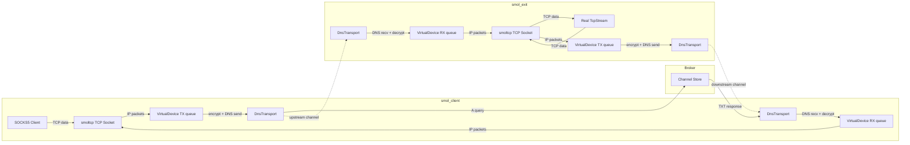
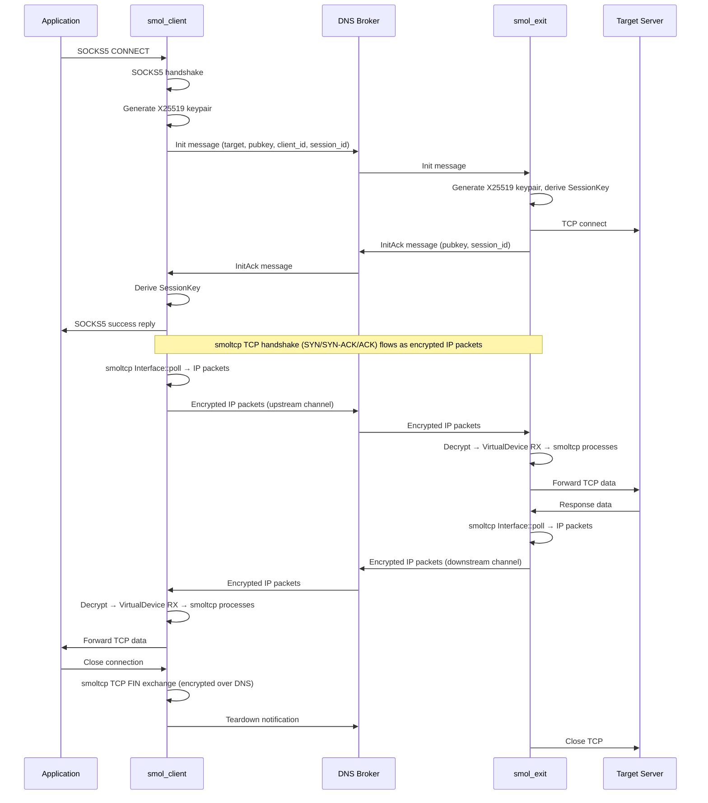

# Design Document: smoltcp Tunnel

## Overview

This design replaces the hand-rolled TCP reliability layer (`reliability.rs`, the SYN/SYN-ACK/FIN/RST state machine in `session.rs`, and the retransmit/reassembly buffers) with [smoltcp](https://github.com/smoltcp-rs/smoltcp), a userspace TCP/IP stack. Two new binaries — `smol_client` and `smol_exit` — are introduced alongside the existing `socks-client` and `exit-node` binaries. The existing broker, DNS transport, crypto, SOCKS5, guard, and config modules are reused unchanged.

The core insight is that the DNS channel between client and exit node is a lossy, high-latency datagram link. smoltcp's `Interface` can operate over any `Device` that sends and receives IP packets — we implement a virtual device whose "wire" is the encrypted DNS channel. smoltcp handles TCP segmentation, retransmission, congestion control, and flow control internally, eliminating ~500 lines of hand-rolled reliability code from the data path.

### Key Design Decisions

1. **Medium::Ip, not Ethernet** — smoltcp supports raw IP medium, avoiding unnecessary Ethernet framing overhead on an already bandwidth-constrained link.
2. **Per-session smoltcp Interface** — each SOCKS5 session gets its own `Interface` + `Device` pair with dedicated virtual IPs. This isolates TCP state between sessions and simplifies cleanup.
3. **Lightweight session initiation** — a new `Init`/`InitAck` message pair (distinct from the old `Syn`/`SynAck` frame types) handles key exchange. Once keys are established, smoltcp's own TCP SYN/SYN-ACK flows over the encrypted link.
4. **Existing encryption reused as-is** — IP packets produced by smoltcp are encrypted with ChaCha20-Poly1305 using the same `SessionKey` derivation. A 12-byte header (session ID + sequence number) prefixes each encrypted payload.
5. **Conservative tuning defaults** — initial RTO ≥ 3s, small windows (4 × MSS), MSS ~100 bytes, matching the DNS link's characteristics.

## Architecture

### Data Flow



### Session Lifecycle



## Components and Interfaces

### 1. VirtualDevice (`smol_device.rs`)

Implements smoltcp's `Device` trait to bridge IP packet I/O to in-memory queues.

```rust
use smoltcp::phy::{Device, DeviceCapabilities, Medium, RxToken, TxToken};
use std::collections::VecDeque;

/// Virtual smoltcp device backed by in-memory packet queues.
/// The poll loop drains tx_queue for encryption/sending and fills
/// rx_queue with decrypted inbound packets.
pub struct VirtualDevice {
    rx_queue: VecDeque<Vec<u8>>,
    tx_queue: VecDeque<Vec<u8>>,
    mtu: usize,
}

impl VirtualDevice {
    pub fn new(mtu: usize) -> Self { ... }

    /// Push a decrypted IP packet into the receive queue.
    pub fn inject_rx(&mut self, packet: Vec<u8>) { ... }

    /// Drain all outbound IP packets produced by smoltcp.
    pub fn drain_tx(&mut self) -> Vec<Vec<u8>> { ... }
}

impl Device for VirtualDevice {
    type RxToken<'a> = VirtualRxToken;
    type TxToken<'a> = VirtualTxToken<'a>;

    fn capabilities(&self) -> DeviceCapabilities {
        let mut caps = DeviceCapabilities::default();
        caps.medium = Medium::Ip;
        caps.max_transmission_unit = self.mtu;
        caps
    }

    fn receive(&mut self, _timestamp: Instant) -> Option<(Self::RxToken<'_>, Self::TxToken<'_>)> { ... }
    fn transmit(&mut self, _timestamp: Instant) -> Option<Self::TxToken<'_>> { ... }
}
```

### 2. Session Initiation Messages (`smol_frame.rs`)

New message types for the lightweight handshake, distinct from the old `FrameType` enum.

```rust
/// Message type byte for smoltcp session initiation.
pub const SMOL_MSG_INIT: u8 = 0x10;
pub const SMOL_MSG_INIT_ACK: u8 = 0x11;
pub const SMOL_MSG_TEARDOWN: u8 = 0x12;

/// Init message: sent by smol_client on the control channel.
/// Layout: msg_type(1) | session_id(8) | addr_type(1) | address(var) | port(2) | pubkey(32) | client_id_len(1) | client_id(var)
pub fn encode_init_message(...) -> Vec<u8> { ... }
pub fn decode_init_message(data: &[u8]) -> Result<InitMessage, SmolFrameError> { ... }

/// InitAck message: sent by smol_exit on the control channel.
/// Layout: msg_type(1) | session_id(8) | pubkey(32)
pub fn encode_init_ack_message(...) -> Vec<u8> { ... }
pub fn decode_init_ack_message(data: &[u8]) -> Result<InitAckMessage, SmolFrameError> { ... }

/// Teardown message: sent by either side on the control channel.
/// Layout: msg_type(1) | session_id(8)
pub fn encode_teardown_message(...) -> Vec<u8> { ... }
pub fn decode_teardown_message(data: &[u8]) -> Result<SessionId, SmolFrameError> { ... }
```

### 3. Encrypted Packet Framing (`smol_frame.rs`)

Each IP packet on the wire is prefixed with a lightweight header for session identification and nonce construction.

```
Wire format for encrypted IP packets:
┌──────────────┬──────────────┬─────────────────────────────────┐
│ session_id   │ seq (BE u32) │ ChaCha20-Poly1305 ciphertext    │
│ (8 bytes)    │ (4 bytes)    │ (IP packet + 16-byte auth tag)  │
└──────────────┴──────────────┴─────────────────────────────────┘
Total header: 12 bytes
```

```rust
/// Encode: prepend session_id + seq, then encrypt the IP packet.
pub fn encrypt_ip_packet(
    session_id: &SessionId,
    seq: u32,
    direction: Direction,
    session_key: &SessionKey,
    ip_packet: &[u8],
) -> Vec<u8> { ... }

/// Decode: extract session_id + seq from header, decrypt the payload.
pub fn decrypt_ip_packet(
    data: &[u8],
    direction: Direction,
    session_key: &SessionKey,
) -> Result<(SessionId, u32, Vec<u8>), SmolFrameError> { ... }
```

### 4. SmolClient Binary (`smol_client.rs`)

```rust
// High-level structure:
// 1. Parse CLI (reuse SocksClientCli + smoltcp-specific flags)
// 2. Bind SOCKS5 listener
// 3. Spawn control channel poller (reuse ControlDispatcher pattern)
// 4. Accept loop: for each SOCKS5 connection:
//    a. SOCKS5 handshake (reuse socks::socks5_handshake)
//    b. Send Init message, wait for InitAck
//    c. Derive SessionKey
//    d. Create VirtualDevice + smoltcp Interface + TCP socket
//    e. smoltcp TCP connect to exit's virtual IP
//    f. Run poll loop: TCP ↔ smoltcp ↔ encrypt/decrypt ↔ DNS transport
//    g. On close: smoltcp FIN, send Teardown, cleanup
```

### 5. SmolExit Binary (`smol_exit.rs`)

```rust
// High-level structure:
// 1. Parse CLI (reuse ExitNodeCli + smoltcp-specific flags)
// 2. Initialize transport (standalone or embedded)
// 3. Poll control channel for Init messages
// 4. For each Init:
//    a. Key exchange, derive SessionKey
//    b. TCP connect to real target (with guard check)
//    c. Send InitAck
//    d. Create VirtualDevice + smoltcp Interface + TCP listener socket
//    e. Run poll loop: real TCP ↔ smoltcp ↔ encrypt/decrypt ↔ DNS transport
//    f. On close: smoltcp FIN, send Teardown, cleanup
```

### 6. Poll Loop (`smol_poll.rs`)

The poll loop is the heart of each session. It coordinates smoltcp's `Interface::poll` with DNS transport I/O.

```rust
/// Run the bidirectional poll loop for a single session.
///
/// Each iteration:
/// 1. Poll broker for inbound encrypted packets
/// 2. Decrypt and inject into VirtualDevice RX queue
/// 3. Call Interface::poll (processes inbound, generates outbound)
/// 4. Drain VirtualDevice TX queue
/// 5. Encrypt and send outbound packets via DNS transport
/// 6. Transfer data between smoltcp TCP socket and local stream
/// 7. Sleep for min(adaptive_interval, poll_delay_hint)
pub async fn run_session_poll_loop(
    iface: &mut Interface,
    device: &mut VirtualDevice,
    socket_handle: SocketHandle,
    transport: &dyn TransportBackend,
    session_id: &SessionId,
    session_key: &SessionKey,
    upstream_channel: &str,
    downstream_channel: &str,
    direction: PollDirection, // Client or Exit
    local_stream: &mut TcpStreamHalf,
    config: &SmolPollConfig,
) -> Result<(), SessionError> { ... }
```

### 7. Configuration Extensions

New CLI flags added to both binaries (alongside existing flags):

| Flag | Default | Description |
|------|---------|-------------|
| `--smol-rto-ms` | `3000` | Initial smoltcp RTO in milliseconds |
| `--smol-window-segments` | `4` | TCP window size in MSS multiples |
| `--smol-mss` | computed | Override MSS (default: derived from DNS payload budget) |

These are parsed into a `SmolTuningConfig` struct:

```rust
pub struct SmolTuningConfig {
    pub initial_rto: Duration,
    pub window_segments: usize,
    pub mss: Option<usize>, // None = auto-compute from payload budget
}
```

## Data Models

### New Types

```rust
/// Configuration for smoltcp tuning parameters.
pub struct SmolTuningConfig {
    pub initial_rto: Duration,      // default: 3000ms
    pub window_segments: usize,     // default: 4
    pub mss: Option<usize>,         // None = auto from payload budget
}

/// Session state for smoltcp-based sessions (replaces old Session struct for new binaries).
pub struct SmolSession {
    pub id: SessionId,
    pub session_key: SessionKey,
    pub upstream_channel: String,
    pub downstream_channel: String,
    pub tx_seq: AtomicU32,          // monotonic sequence for encryption nonces
    pub rx_seq_seen: AtomicU32,     // highest rx seq (for replay detection)
}

/// Init message parsed fields.
pub struct InitMessage {
    pub session_id: SessionId,
    pub target_addr: TargetAddr,
    pub target_port: u16,
    pub pubkey: [u8; 32],
    pub client_id: String,
}

/// InitAck message parsed fields.
pub struct InitAckMessage {
    pub session_id: SessionId,
    pub pubkey: [u8; 32],
}

/// Poll loop configuration.
pub struct SmolPollConfig {
    pub poll_active: Duration,      // fast poll interval (default: 50ms)
    pub poll_idle: Duration,        // slow poll interval (default: 500ms)
    pub backoff_max: Duration,      // max backoff (default: poll_idle)
    pub query_interval: Duration,   // DNS rate limit
    pub no_edns: bool,
}

/// Direction of the poll loop (determines encrypt/decrypt direction byte).
pub enum PollDirection {
    Client, // encrypts upstream, decrypts downstream
    Exit,   // encrypts downstream, decrypts upstream
}
```

### Virtual IP Addressing

Each session uses a point-to-point virtual IP pair from `192.168.69.0/24`:

| Role | Virtual IP | Purpose |
|------|-----------|---------|
| smol_client | `192.168.69.1` | Source IP for smoltcp on client side |
| smol_exit | `192.168.69.2` | Source IP for smoltcp on exit side |

The smol_client's TCP socket connects to `192.168.69.2:<designated_port>`. The smol_exit listens on `192.168.69.2:<designated_port>`. The designated port is a fixed value (e.g., `4321`) since there's only one TCP connection per smoltcp Interface.

### MTU Calculation

```
dns_payload_budget = compute_payload_budget(domain_len, sender_id_len, channel_len, nonce_len)
encrypted_overhead = 12 (session_id + seq) + 16 (Poly1305 tag)
mtu = dns_payload_budget - encrypted_overhead

Example with domain="t.co", sender_id="c1", channel="u-aBcD1234":
  dns_payload_budget = ~107 bytes
  mtu = 107 - 28 = 79 bytes

MSS = mtu - 20 (IPv4 header) - 20 (TCP header) = 39 bytes (minimum viable)
```

With longer domains the MSS will be even smaller. The `--smol-mss` flag allows overriding if the user knows their DNS path supports larger payloads.

### smoltcp Interface Configuration

```rust
fn create_smol_interface(
    device: &mut VirtualDevice,
    local_ip: Ipv4Addr,    // 192.168.69.1 or .2
    gateway_ip: Ipv4Addr,  // the peer's IP
    tuning: &SmolTuningConfig,
) -> Interface {
    let mut config = smoltcp::iface::Config::new(smoltcp::wire::HardwareAddress::Ip);
    let mut iface = Interface::new(config, device, smoltcp::time::Instant::now());

    // Add IP address
    iface.update_ip_addrs(|addrs| {
        addrs.push(IpCidr::new(local_ip.into(), 24)).unwrap();
    });

    // Add default route through peer
    iface.routes_mut().add_default_ipv4_route(gateway_ip).unwrap();

    iface
}

fn create_tcp_socket(tuning: &SmolTuningConfig, mss: usize) -> smoltcp::socket::tcp::Socket<'static> {
    let rx_buf = smoltcp::socket::tcp::SocketBuffer::new(vec![0; mss * tuning.window_segments]);
    let tx_buf = smoltcp::socket::tcp::SocketBuffer::new(vec![0; mss * tuning.window_segments]);
    let mut socket = smoltcp::socket::tcp::Socket::new(rx_buf, tx_buf);

    // Tune for high-latency DNS link
    // smoltcp doesn't expose direct RTO setting, but we can influence it
    // through keep-alive and timeout configuration
    socket.set_timeout(Some(smoltcp::time::Duration::from_secs(120)));
    socket.set_keep_alive(Some(smoltcp::time::Duration::from_secs(30)));

    socket
}
```

## Correctness Properties

*A property is a characteristic or behavior that should hold true across all valid executions of a system — essentially, a formal statement about what the system should do. Properties serve as the bridge between human-readable specifications and machine-verifiable correctness guarantees.*

### Property 1: VirtualDevice TX preserves packets

*For any* byte sequence written via the VirtualDevice's `transmit` TxToken, calling `drain_tx` should return that exact byte sequence in the TX queue.

**Validates: Requirements 2.2**

### Property 2: VirtualDevice RX preserves packets

*For any* byte sequence injected via `inject_rx`, calling `receive` on the VirtualDevice should yield an RxToken that produces that exact byte sequence.

**Validates: Requirements 2.3**

### Property 3: MTU and MSS are consistent with DNS payload budget

*For any* valid combination of domain length, sender ID length, channel length, and nonce length, the VirtualDevice's reported MTU should equal `compute_payload_budget(...) - 12 (header) - 16 (auth tag)`, and the derived MSS should equal `MTU - 40` (IPv4 + TCP headers), and both values should be non-negative.

**Validates: Requirements 2.4, 3.2**

### Property 4: TCP buffer sizes are bounded by window configuration

*For any* MSS value and window_segments value, the smoltcp TCP socket's receive buffer size and send buffer size should both equal `MSS * window_segments`, which is at most `4 * MSS` when using the default window_segments of 4.

**Validates: Requirements 4.2, 4.3**

### Property 5: CLI tuning flags override defaults

*For any* valid `--smol-rto-ms`, `--smol-window-segments`, and `--smol-mss` values, parsing the CLI into a `SmolTuningConfig` should produce a config where each field matches the provided value rather than the default.

**Validates: Requirements 4.4**

### Property 6: Session message encode/decode round trip

*For any* valid `InitMessage` (with arbitrary session ID, target address type, target port, 32-byte public key, and client ID string), encoding then decoding should produce an identical `InitMessage`. The same round-trip property holds for `InitAckMessage` and `Teardown` messages.

**Validates: Requirements 7.1, 7.2**

### Property 7: IP packet encryption round trip

*For any* valid session ID, sequence number, direction, session key, and IP packet byte sequence, calling `encrypt_ip_packet` followed by `decrypt_ip_packet` should return the original session ID, sequence number, and IP packet bytes.

**Validates: Requirements 8.1, 8.2, 8.5**

### Property 8: Tampered ciphertext is rejected

*For any* encrypted IP packet produced by `encrypt_ip_packet`, flipping any single bit in the ciphertext portion (after the 12-byte header) should cause `decrypt_ip_packet` to return a decryption error.

**Validates: Requirements 8.3**

### Property 9: Direction and sequence number produce distinct ciphertexts

*For any* IP packet and session key, encrypting the same plaintext with different `(direction, seq)` pairs should produce different ciphertext. Specifically, changing either the direction byte or the sequence number (or both) must result in a different encrypted output.

**Validates: Requirements 8.4**

## Error Handling

### VirtualDevice Errors

| Condition | Behavior |
|-----------|----------|
| TX queue full (smoltcp producing packets faster than DNS can send) | `transmit()` returns `None`, causing smoltcp to back-pressure internally. The poll loop drains TX on every cycle, so this should be transient. |
| RX queue empty (no inbound packets) | `receive()` returns `None`. smoltcp handles this gracefully — it simply has no new data to process. |
| MTU too small for any useful payload | Detected at startup. Log error and abort session creation. The `--smol-mss` flag can override. |

### Session Initiation Errors

| Condition | Behavior |
|-----------|----------|
| Init message MAC verification fails | Discard message, log warning. Do not respond. |
| Init message decode fails (malformed) | Discard message, log warning. Do not respond. |
| InitAck timeout (default 30s) | smol_client aborts session, sends SOCKS5 error reply (0x04 host unreachable), cleans up. |
| TCP connect to target fails | smol_exit sends no InitAck (session never established). Client times out. |
| TCP connect to target blocked by guard | smol_exit logs warning, does not respond. Client times out. |
| InitAck MAC verification fails | smol_client discards, waits for valid InitAck or timeout. |

### Encryption/Decryption Errors

| Condition | Behavior |
|-----------|----------|
| Decryption fails (auth tag mismatch) | Discard packet, log warning at debug level. Do not inject into VirtualDevice. smoltcp will retransmit the lost segment. |
| Sequence number overflow (u32 wrap) | Extremely unlikely at DNS throughput (~100 bytes/packet). If reached, tear down session. |
| Session ID mismatch in header | Discard packet, log warning. Wrong session's packet on this channel. |

### smoltcp TCP Errors

| Condition | Behavior |
|-----------|----------|
| TCP connection timeout (smoltcp internal) | smoltcp closes socket. Poll loop detects closed state, sends Teardown on control channel, cleans up. |
| TCP RST received | smoltcp closes socket. Poll loop detects, sends Teardown, cleans up. |
| smoltcp `Interface::poll` returns error | Log error, continue polling. smoltcp is resilient to transient errors. |

### Transport Errors

| Condition | Behavior |
|-----------|----------|
| DNS query timeout | Retry with backoff (existing AdaptiveBackoff). smoltcp handles the lost packet via TCP retransmission. |
| Channel full | Retry with backoff (existing pattern). Outbound IP packets queue in VirtualDevice TX buffer. |
| Broker unreachable | Backoff increases to poll_idle. smoltcp TCP will eventually time out if broker stays down. |

## Testing Strategy

### Unit Tests

Unit tests cover specific examples and edge cases for the new modules:

- **VirtualDevice**: Empty queue behavior, single packet round trip, multiple packets ordering, MTU reporting.
- **smol_frame**: Init/InitAck/Teardown encoding with specific known values, boundary cases (empty client_id, max-length domain, IPv4/IPv6/Domain address types), malformed input rejection.
- **encrypt_ip_packet / decrypt_ip_packet**: Known-answer test with fixed key/nonce, empty payload, maximum-size payload, wrong key rejection.
- **SmolTuningConfig**: Default values, CLI override parsing, invalid values (zero MSS, negative RTO).
- **MTU calculation**: Specific domain/channel combinations, edge case where budget is too small.

### Property-Based Tests

Property-based tests use the `proptest` crate (already a dev-dependency) with a minimum of 100 iterations per property. Each test references its design document property.

| Property | Test Description | Generator Strategy |
|----------|-----------------|-------------------|
| Property 1 | TX queue preserves packets | `proptest::collection::vec(any::<u8>(), 0..200)` for packet bytes |
| Property 2 | RX queue preserves packets | Same as Property 1 |
| Property 3 | MTU/MSS consistency | `(1..50usize, 1..20usize, 5..15usize, 4usize)` for (domain_len, sender_len, channel_len, nonce_len) |
| Property 4 | Buffer size bounds | `(1..200usize, 1..8usize)` for (mss, window_segments) |
| Property 5 | CLI override | `(100..10000u64, 1..16usize, 20..200usize)` for (rto_ms, window_segments, mss) |
| Property 6 | Message round trip | Arbitrary SessionId, TargetAddr (IPv4/IPv6/Domain), port, pubkey, client_id |
| Property 7 | Encryption round trip | Arbitrary SessionId, seq (u32), direction, 32-byte key, packet bytes (0..200) |
| Property 8 | Tamper detection | Same as Property 7 + random bit flip position |
| Property 9 | Nonce uniqueness | Same plaintext + key, two different (direction, seq) pairs |

Each property test must be tagged with a comment:
```rust
// Feature: smoltcp-tunnel, Property N: <property_text>
```

### Integration Testing

Integration tests are out of scope for the property-based testing strategy but should be added separately:

- End-to-end test with smol_client ↔ broker ↔ smol_exit using `DirectTransport` (in-process broker)
- Verify a SOCKS5 CONNECT through the full stack returns expected HTTP response
- Concurrent session test: multiple SOCKS5 connections simultaneously
- Graceful shutdown: verify Teardown messages are sent and resources cleaned up
